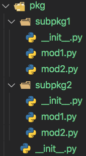

# Tecnologías Específicas en Ingeniería Informática • Developer's Guide Vol. 1

- [Tecnologías Específicas en Ingeniería Informática • Developer's Guide Vol. 1](#tecnologías-específicas-en-ingeniería-informática--developers-guide-vol-1)
  - [Ejecución de código Python](#ejecución-de-código-python)
    - [El intérprete de Python](#el-intérprete-de-python)
    - [*Scripts* y Módulos](#scripts-y-módulos)
    - [¿Cómo ejecuta el intérprete los archivos `.py`?](#cómo-ejecuta-el-intérprete-los-archivos-py)
    - [Prácticas recomendadas para usar la función `main()`](#prácticas-recomendadas-para-usar-la-función-main)
    - [¿Cómo se importa y usa un módulo Python?](#cómo-se-importa-y-usa-un-módulo-python)
  - [Organización de código Python](#organización-de-código-python)
    - [Módulos, Paquetes y Subpaquetes](#módulos-paquetes-y-subpaquetes)
      - [Importación de Paquetes](#importación-de-paquetes)
      - [Importación de Subpaquetes](#importación-de-subpaquetes)
    - [Ejercicio 1](#ejercicio-1)
  - [*Logging* en Python](#logging-en-python)
    - [El módulo `logging` de Python](#el-módulo-logging-de-python)
    - [Ejercicio 2](#ejercicio-2)
  - [Referencias](#referencias)
    - [Paquetes, Subpaquetes, Módulos y *Scripts*](#paquetes-subpaquetes-módulos-y-scripts)
    - [*Logging*](#logging)

## Ejecución de código Python

### El intérprete de Python

El intérprete de Python es un programa que compila y ejecuta código Python. Hay
intérpretes de Python escritos en diferentes lenguajes de programación como, por
ejemplo, [CPython](https://www.python.org) (C), [Jython](https://www.jython.org)
(Java) o [PyPy](https://www.pypy.org) (Python).

El intérprete de Python puede ejecutar código Python de dos formas diferentes:

- *Scripts* o módulos.
- Sesión interactiva.

### *Scripts* y Módulos

Tanto los ***scripts*** como los **módulos** son archivos con extensión `.py`
que contienen código Python. La diferencia entre un *script* y un módulo es que
el *script* se ejecuta directamente, mientras que el módulo es importado desde
otro módulo o  *script*. Como veremos más adelante, un archivo `.py` puede ser
usado como *script* o como módulo.

### ¿Cómo ejecuta el intérprete los archivos `.py`?

- Procesa las líneas del *script* de manera secuencial.
- Traduce el código fuente a un formato intermedio (*bytecode*).
- Ejecuta el código en formato *bytecode* (Python Virtual Machine).

Muchos lenguajes de programación tienen una función especial que se ejecuta
cuando el sistema operativo ejecuta un programa escrito en dicho lenguaje. Esa
función, que se llama normalmente `main()`, tiene unos argumentos y un valor de
retorno de acuerdo al estándar del lenguaje de programación concreto. Por el
contrario, el intérprete de Python ejecuta un cada archivo `.py` desde el
principio, es decir, no hay una función como la descrita anteriormente. No
obstante, definir un punto de inicio para el programa es útil para comprender
como funciona. Por este motivo, los programadores de Python siguen algunas
convenciones para definirlo. Por ejemplo, este bloque de código, que define y
llama a una función `main()`, es muy común en archivos `.py` que queremos que
puedan ser ejecutados como *scripts* o importados como módulos:

```python
def main():
    print("Hello, TEII!")

if __name__ == "__main__":
    main()
```

:pushpin: `__name__` es `"__main__"` cuando el código se lee de la entrada estándar, de
un *script* o de una sesión interactiva, o el nombre del módulo cuando este se importa.

Desde la línea de órdenes, los *scripts* se pueden ejecutar de tres formas
distintas:

```bash
$ python3 hello.py
Hello, TEII!

$ python3 -m hello   # Se omite la extensión
Hello, TEII!

$ ./hello.py   # Require añadir '#!/usr/bin/env python3' y ejecutar 'chmod +x hello.py'
Hello, TEII!
```

En los tres casos el resultado es el mismo porque `__name__` toma el valor
`"__main__"`.

### Prácticas recomendadas para usar la función `main()`

- Organizar todo el código de manera modular en funciones o clases.
- Crear una función `main()` que inicie la ejecución del código.
- Usar `__name__` para controlar cuándo se llama a `main()`.
- Llamar a las demás funciones desde la función `main()`.

### ¿Cómo se importa y usa un módulo Python?

Ahora supongamos que tenemos un *script* llamado `main.py` que quiere usar la
función `help()` definida en el módulo `help.py`. Para poder usarla, se tiene
que importar el módulo `help` en el *script* `main.py`:

```python
# help.py
print("Running help...")

hstring = "__name__ is"

def help():
    print(f"help: {hstring} '{__name__}'")
```

```python
# main.py
import help

def main():
    print(f"main: {help.hstring} '{__name__}'")
    help.help()

if __name__ == "__main__":
    main()
```

Si ejecutamos el *script* `main.py`, comprobaremos que tras importar el módulo
`help` se puede ejecutar usar tanto la cadena `hstring` como la función `help()`:

```bash
$ python3 main.py
Running help...
main: __name__ is '__main__'
help: __name__ is 'help'
```

Cuando se importa un módulo, se ejecuta su contenido (sólo la primera vez que se
carga el módulo) y todas las clases, funciones o variables definidas en él están
disponibles a partir de ese momento para su uso posterior. Por ejemplo:

```bash
$ python3
>>> import help
Running help...
>>> import help
>>> dir()
['__annotations__', '__builtins__', '__doc__', '__loader__', '__name__', '__package__', '__spec__', 'help']
>>> help
<module 'help' from '$USER/path/to/help.py'>
>>> dir(help)
['__builtins__', '__cached__', '__doc__', '__file__', '__loader__', '__name__', '__package__', '__spec__', 'hstring', 'help']
>>> help.hstring
'__name__ is'
>>> help.help()
help: __name__ is 'help'
```

:pushpin: Cada módulo define un espacio de nombres independiente a partir del
nombre del módulo, `help` en este caso, que contiene clases, funciones o
variables. El contenido de un espacio de nombres se puede consultar con la
función `dir()`.

Para que **`import`** funcione correctamente, el archivo `.py` del módulo debe estar
en la **ruta de búsqueda de módulos**:

- El mismo directorio en el que se encuentra el *script*.
- El directorio de trabajo desde el que se ejecuta el *script*.
- La lista de directorios en la variable de entorno `PYTHONPATH`.
- La lista de directorios predefinida de la instalación Python.

```bash
$ python3
>>> import sys
>>> sys.path
['', ..., $USER/.pyenv/versions/venv-teii/lib/python3.8/site-packages']
```

Otra alternativa para poder importar un módulo es utilizar **`from`**:

```python
# main.py
from help import hstring, help

def main():
  print(f"main: {hstring} '{__name__}'")
  help()

if __name__ == "__main__":
    main()
```

Si ejecutamos de nuevo el *script* `main.py`, comprobaremos que el resultado es
el mismo que antes. Sin embargo, `import` y `from` no son equivalentes porque
los objetos importados con `import` permanecen en el espacio de nombres del
módulo importado, mientras que los importados con `from` se incorporan al
espacio de nombres del módulo que lleva a cabo la importación:

```bash
$ python3
>>> from help import help   # Importa la función 'help()' pero no la cadena 'hstring'
Running help...
>>> from help import help
>>> dir()
['__annotations__', '__builtins__', '__doc__', '__loader__', '__name__', '__package__', '__spec__', 'help']
>>> help
<function help at 0x104be1170>
>>> help()
help: __name__ is 'help'
```

En resumen:

- `import <module_name>` incorpora `<module_name>` al espacio de nombres actual.
  Dada una clase, función o variable definida en `<module_name>`, se puede
  acceder a ella con `<module_name>.class|func|var`.
- `from <module_name> import <name(s)>` incorpora al espacio de nombres actual
  las clases, funciones o variables en la lista `<name(s)>`.

:warning: En general, se prefiere `import` porque no poluciona el espacio de
nombres actual. Si `from` importa una clase, función o variable que ya existe,
ésta se sobreescribe. Particularmente peligroso es `from <module_name> import *`
porque incorpora todas las funciones y objetos del módulo al espacio de nombres
del importador, sustituyendo aquellos que tuvieran el mismo nombre, lo que puede
dar lugar a errores difíciles de depurar.

## Organización de código Python

En Python, el código se divide en módulos, paquetes y subpaquetes. Cada uno de
ellos posee su propio espacio de nombres.

### Módulos, Paquetes y Subpaquetes

Definición de módulo:

> An object that serves as an organizational unit of Python code. Modules have a
> namespace containing arbitrary Python objects. Modules are loaded into Python
> by the process of importing.

Definición de paquete:

> A Python module which can contain submodules or recursively, subpackages.
> Technically, a package is a Python module with a `__path__` attribute.

La siguiente figura representa la jerarquía de directorios de un paquete `pkg`
con dos subpaquetes, `subpkg1` y `subpkg2`, que tienen dos módulos cada uno:



El archivo `__init__.py`, si existe (suele estar vacío), se ejecuta cuando se
importa el paquete o subpaquete.

Si el paquete se encuentra en la ruta de búsqueda de módulos, podemos importar
el paquete completo, sus subpaquetes o los módulos incluidos en esos
subpaquetes.

#### Importación de Paquetes

```bash
$ python3
>>> import pkg
Running pkg.__init__.py
>>> dir()
['__annotations__', '__builtins__', '__doc__', '__loader__', '__name__', '__package__', '__spec__', 'pkg']
>>> dir(pkg)   # El archivo 'pkg/__init__.py' está vacío y no se importa nada más
['__builtins__', '__cached__', '__doc__', '__file__', '__loader__', '__name__', '__package__', '__path__', '__spec__']
>>> pkg.__file__
'$USER/path/to/pkg/__init__.py'
>>> pkg.__name__
'pkg'
>>> pkg.__path__
['$USER/path/to/pkg']
```

#### Importación de Subpaquetes

En primer lugar, veamos lo que sucede cuando se importan subpaquetes en los que
el archivo `__init__.py` está vacío.

```bash
$ python3
>>> import pkg.subpkg1
Running pkg.__init__.py
Running pkg.subpkg1.__init__.py
>>> dir()   # Se ha importado 'pkg' en el espacio de nombres actual
[..., 'pkg']
>>> dir(pkg)   # Se ha importado 'subpkg1' en el espacio de nombres 'pkg'
[..., 'subpkg1']
>>> dir(pkg.subpkg1)   # El archivo 'pkg/subpkg1/__init__.py' está vacío y no se importa nada más
[...]

>>> import pkg.subpkg1.mod1
>>> dir(pkg.subpkg1.mod1)   # Se han importado tanto 'a' como 'foo()' en 'pkg.subpkg1.mod1'
[..., 'a', 'foo']
>>> pkg.subpkg1.mod1.a
'foo'
>>> pkg.subpkg1.mod1.foo()
[pkg.subpkg1.mod1] foo()

>>> from pkg.subpkg1.mod1 import *
>>> dir()   # Se han importado tanto 'a' como 'foo()' en el espacio de nombres actual
[..., 'a', 'foo', 'pkg']
>>> a
'foo'
>>> foo()
[pkg.subpkg1.mod1] foo()

>>> import pkg.subpkg1.mod2
>>> dir(pkg.subpkg1.mod2)   # Se han importado tanto '_b' y ' bar()' en 'pkg.subpkg2.mod2'
[..., '_b', 'bar']
>>> pkg.subpkg1.mod2._b
'bar'
>>> pkg.subpkg1.mod2.bar()
[pkg.subpkg1.mod2] bar()

>>> from pkg.subpkg1.mod2 import *
>>> dir()   # Se ha importado 'bar()' en el espacio de nombres actual pero no '_b'
[..., 'a', 'bar', 'foo', 'pkg']
```

El mecanismo de importación se puede alterar modificando el contenido de los
archivos `__init__.py`:

```python
# pkg/subpkg2/__init__.py
from .mod3 import baz

__all__ = ['baz']

print("Running pkg.subpkg2.__init__.py")
```

:pushpin: En este archivo la importación es relativa de manera que en `.mod3`,
el `.` se refiere al (sub)paquete actual. También es posible acceder a otros
subpaquetes. Por ejemplo, si incluimos dentro del `__init__.py` del subpaquete
`pkg.subpkg2`, la línea `from ..subpkg1.mod1 import foo`, con `..` iríamos al
padre del módulo importador, es decir, a `pkg`, y accederíamos al módulo
`mod1.py` del subpaquete `subpkg1` para importar la función `foo()`, pudiendo
ejecutarla con `pkg.subpkg2.foo()`, puesto que se habrá incorporado al espacio
de nombres de `pkg.subpkg2`.

```bash
$ python3
>>> import pkg.subpkg2
Running pkg.__init__.py
Running pkg.subpkg2.__init__.py
>>> dir()   # Se ha importado 'pkg' en el espacio de nombres actual
[..., 'pkg']
>>> dir(pkg)   # Se ha importado 'subpkg2' en el espacio de nombres 'pkg'
[..., 'subpkg2']
>>> dir(pkg.subpkg2)   # El archivo 'pkg/subpkg2/__init__.py' importa 'baz()' y 'mod3' en 'pkg.subpkg2'
[..., 'baz', 'mod3']
>>> pkg.subpkg2.baz()   # Nótese que a diferencia de ejemplos anteriores, omitimos 'mod3'
[pkg.subpkg2.mod3] baz()

>>> from pkg.subpkg2 import *
>>> dir()   # Se ha importado 'baz' en el espacio de nombres actual porque
            # aparece en la lista '__all__' de 'pkg/subpkg2/__init__.py'
[..., 'baz', 'pkg']

>>> from pkg.subpkg2.mod4 import *
>>> dir()   # Se ha importado '_d' pero no 'qux()' porque
            # sólo '_d' aparece en la lista '__all__' de 'pkg/subpkg2/mod4.py'
[..., '_d', 'baz', 'pkg']
```

En resumen:

- Si el archivo `__init__.py` de un paquete contiene una lista llamada `__all__`,
con `from <module_name> import *` sólo se importan los módulos, clases,
funciones o variables que aparecen en dicha lista. En ausencia de dicha lista,
no se importa nada.
- Si un módulo define la lista `__all__`, al igual que con un paquete, con `from
<module_name> import *`  sólo se importan las clases, funciones o variables de
la lista. A diferencia de los paquetes, si no se define dicha lista, se importan
todas las clases, funciones y variables excepto aquellas que empiezan con `_`.

Como ejemplo de aplicación práctica de estos conceptos, véanse el paquete `teii`
y el subpaquete `teii-finance`.

### Ejercicio 1

El archivo `teii/__init__.py` está vacío pero el archivo
`teii/finance/__init__.py` no. ¿Para qué sirve el contenido del archivo
`teii/finance/__init__.py`?

## *Logging* en Python

El término *logging* se refiere al registro de eventos que suceden cuando se
ejecuta un programa. Un evento es un mensaje que puede contener datos variables,
es decir, datos potencialmente diferentes para cada ocurrencia de ese evento.
Con frecuencia, los desarrolladores recurren a `print()` para registrar los
eventos. No obstante, este método es muy inflexible:

- No se puede asignar un grado de importancia a cada evento.
- No se puede filtrar un evento en función de su importancia.
- No se puede modificar el formato de los eventos.
- No se puede seleccionar el destino de los eventos.

El módulo `logging` de Python resuelve estas deficiencias proporcionando un
*framework* para *logging* muy flexible.

### El módulo `logging` de Python

El módulo `logging` define cinco niveles distintos de severidad para los
mensajes que, en orden ascendente de importancia, son: `DEBUG`, `INFO`,
`WARNING`, `ERROR` y `CRITICAL`.

Usar el módulo `logging` es tan sencillo como importarlo y llamar al método
correspondiente al nivel de severidad:

```python
import logging

logging.debug('This is a debug message')
logging.info('This is an info message')
logging.warning('This is a warning message')
logging.error('This is an error message')
logging.critical('This is a critical message')
```

:pushpin: El módulo `logging` sólo muestra aquellos mensajes con un nivel de
severidad mayor que o igual al nivel de severidad definido por el usuario. Si no
se especifica, el nivel de severidad por defecto es `WARNING`. Todos los
mensajes con un nivel mayor o igual que él, es decir, `WARNING`, `ERROR` y
`CRITICAL` serán enviados a la consola.

El módulo `logging` se puede configurar con el método `basicConfig()`. Sus
parámetros más usados con:

- `level`: Para cambiar el nivel de severidad.
- `filename`: Para enviar los mensajes a un fichero en lugar de a la consola.
- `format`: Para definir el formato de los mensajes.

:warning: La función `basicConfig()` se debe ejecutar antes de registrar el
primer evento.

Si nos limitamos a usar las funciones del módulo `logging`, estaremos usando el
*logger* por defecto que se llama `root`. Normalmente, se crean *loggers* a
partir del módulo `logging` con el método `getLogger()` para poder asignarles un
nombre diferente y modificar su nivel de severidad de manera independiente.

Para más detalles, véanse el *script* `example.py` y el método
`_setup_logging()` de la clase `FinanceClient()` en el módulo `finance.py` del
subpaquete `teii.finance`.

### Ejercicio 2

¿Por qué no se muestra ningún mensaje de *logging* al ejecutar `example.py`?

## Referencias

### Paquetes, Subpaquetes, Módulos y *Scripts*

- [Python Documentation • The `import` system](https://docs.python.org/3.8/reference/import.html)
- [Real Python • Defining Main Functions in Python](https://realpython.com/python-main-function/)
- [Real Python • How to Run Your Python Scripts](https://realpython.com/run-python-scripts/)
- [Real Python • Python Modules and Packages – An Introduction](https://realpython.com/python-modules-packages/)
- [Real Python • Python import: Advanced Techniques and Tips](https://realpython.com/python-import/)

### *Logging*

- [Python Documentation • `logging` — Logging facility for Python](https://docs.python.org/3.8/library/logging.html)
- [Python Documentation • Logging HOWTO](https://docs.python.org/3.8/howto/logging.html)
- [Real Python • Logging in Python](https://realpython.com/python-logging/)
