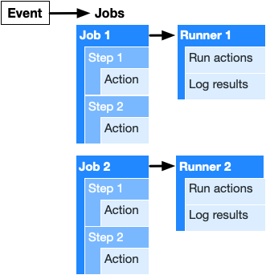

# Tecnologías Específicas en Ingeniería Informática • Developer's Guide Vol. 3

- [Tecnologías Específicas en Ingeniería Informática • Developer's Guide Vol. 3](#tecnologías-específicas-en-ingeniería-informática--developers-guide-vol-3)
  - [Empaquetado y distribución de código Python](#empaquetado-y-distribución-de-código-python)
    - [El formato `wheels`](#el-formato-wheels)
    - [Generación de `wheels` para el paquete `teii`](#generación-de-wheels-para-el-paquete-teii)
    - [Verificación de `wheels` para el paquete `teii`](#verificación-de-wheels-para-el-paquete-teii)
  - [CI/CD con GitHub](#cicd-con-github)
    - [*Continuous Integration* (CI)](#continuous-integration-ci)
      - [`tox`: *Standardized testing in Python*](#tox-standardized-testing-in-python)
      - [GitHub Actions](#github-actions)
      - [CI con `tox` y GitHub Actions](#ci-con-tox-y-github-actions)
    - [*Continuous Delivery* (CD)](#continuous-delivery-cd)
      - [CD con GitHub Actions y TestPyPi](#cd-con-github-actions-y-testpypi)
  - [Referencias](#referencias)
    - [Empaquetado](#empaquetado)
    - [CI/CD: `tox` y GitHub Actions](#cicd-tox-y-github-actions)

## Empaquetado y distribución de código Python

Uno de los objetivos de estructurar el código en paquetes, subpaquetes y módulos
es poder distribuirlo para que se pueda usar en otros proyectos mediante el
mecanismo de importación explicado anteriormente.

Un módulo puede distribuirse directamente. Sin embargo, sólo podremos garantizar
que funcionará correctamente si usa únicamente la biblioteca estándar de Python
y una versión de Python concreta:

- En la instalación Python en la que se importa el módulo, podrían no estar
  presentes algunas de sus dependencias.
- Cada versión de Python suele incorporar nuevas características no presentes en
  versiones anteriores.

Por este motivo, se necesita un formato de empaquetado para el código Python que
permita distribuir paquetes, con varios subpaquetes o múltiples módulos, que
requieran otros paquetes o simplemente una versión específica de Python.

En Python hay dos tipos básicos de empaquetado: **distribución fuente**
(`sdist`) y **distribución binaria** (`bdist`). Una distribución fuente consiste
en un archivo contenedor comprimido (por ejemplo, un archivo `.zip`) que
contiene sólo código fuente. Si el paquete necesita bibliotecas escritas en
otros lenguajes de programación, cuando se instala se compilan dichas
bibliotecas. Por su parte, una distribución binaria puede incluir bibliotecas
pre-compiladas escritas en otros lenguajes de programación. Eso implica tener
versiones de la distribución binaria para distintas versiones de Python y
plataformas.

### El formato `wheels`

El formato `wheels` (`.whl`) es el formato de distribución binaria [más usado
actualmente](https://pythonwheels.com/). Este formato es la opción por defecto
para `pip3`, incluso para distribuciones fuente, porque es más rápido. Por
ejemplo, en el [*Python Package Index* (PyPi)](https://pypi.org/) pueden
encontrarse [múltiples distribuciones binarias (`.whl`) y una distribución
fuente (`.zip`) para el paquete `numpy`](https://pypi.org/project/numpy/#files).

Si lo instalamos:

```bash
$ pyenv virtualenv 3.8.18 venv-teii-test
$ pyenv activate venv-teii-test
(venv-teii-test) $ pip3 install numpy
Collecting numpy
  Downloading numpy-1.24.4-cp38-cp38-manylinux_2_17_x86_64.manylinux2014_x86_64.whl (17.3 MB)
Installing collected packages: numpy
Successfully installed numpy-1.24.4

(venv-teii-test) $ pip3 uninstall numpy   # elimina varias bibliotecas instaladas con numpy
```

`pip3` opta por la distribución binaria que corresponde a nuestra plataforma.

Si especificamos que la instalación se realice a partir de la distribución fuente:

```bash
(venv-teii-test) $ pip3 install --no-binary :all: numpy

Collecting numpy
  Downloading numpy-1.24.4.tar.gz (10.9 MB)
  Installing build dependencies ... done
  Getting requirements to build wheel ... done
  Preparing metadata (pyproject.toml) ... done
Building wheels for collected packages: numpy
  Building wheel for numpy (pyproject.toml) ... done
  Created wheel for numpy: filename=numpy-1.24.4-cp38-cp38-linux_x86_64.whl size=26277780 sha256=...
  Stored in directory: /home/alumno/.cache/pip/wheels/...
Successfully built numpy
Installing collected packages: numpy
Successfully installed numpy-1.24.4

(venv-teii-test) $ pip3 uninstall numpy   # elimina varias bibliotecas instaladas con numpy
(venv-teii-test) $ pyenv deactivate
$ pyenv virtualenv-delete venv-teii-test
```

`pip3` instalará `numpy` compilando la bibliotecas que necesita.

Un archivo con extensión `.whl` es básicamente un archivo `.zip` con un nombre
que sigue una determinada nomenclatura para indicarle a `pip3` la versión de
Python y la plataforma que soporta:

`{dist}-{version}-{python}-{abi}-{platform}.whl`

- `dist`: Nombre del paquete (`numpy`).
- `version`: Versión del paquete (`1.24.4`).
- `python`: Versión de Python (`cp38`).
- `abi`: Application Binary Interface o ABI (`cp38m`).
- `platform`: Plataforma (`manylinux_2_17_x86_64.manylinux2014_x86_64`).

:pushpin: El significado de las etiquetas `platform` pueden encontrarse
[aquí](https://peps.python.org/pep-0600/).

### Generación de `wheels` para el paquete `teii`

La creación de un archivo de distribución binaria en formato `wheels` requiere
los paquetes `wheel` y `setuptools`.

Para generar un archivo `.whl` para el paquete `teii`, basta con ejecutar el
*script* `setup.py` indicando el tipo de distribución:

```bash
(venv-teii) $ python3 setup.py bdist_wheel            # crea el archivo '.whl'
(venv-teii) $ ls dist                                 # en el directorio 'dist'
teii-0-py3-none-any.whl
(venv-teii) $ unzip -l dist/teii-0-py3-none-any.whl   # lista los archivos empaquetados en el archivo '.whl'
(venv-teii) $ pyenv deactivate venv-teii
```

:pushpin: El formato `wheels` no incluye directorios `__pycache__` ni archivos
`.pyc`.

Como vemos, se genera un archivo `.whl` apto para cualquier plataforma porque
`teii` sólo contiene código Python.

La generación se configura con los parámetros de la función  `setup()` del
módulo `setuptools` invocada en `setup.py`.

### Verificación de `wheels` para el paquete `teii`

Con objeto de comprobar que la distribución binaria del paquete `teii` es
correcta, seguiremos los siguientes pasos:

<!-- markdownlint-disable MD029-->
1. Creación y activación de un entorno virtual llamado `venv-teii-test`.

<!-- markdownlint-disable MD014-->
```bash
$ pyenv virtualenv 3.8.18 venv-teii-test
$ pyenv activate venv-teii-test
```
<!-- markdownlint-enable MD014-->

2. Instalación del paquete `teii` en `venv-teii-test`.

```bash
(venv-teii-test) $ cd dist
(venv-teii-test) $ pip3 install teii-0-py3-none-any.whl   # instala el paquete 'teii' y todas sus dependencias
```

3. Ejecución del ejemplo `example.py` en `venv-teii-test`.

```bash
(venv-teii-test) $ pip3 install matplotlib   # 'example.py' necesita el paquete 'matplotlib'
(venv-teii-test) $ cp ../example.py .   # el código fuente no debe estar en la ruta de búsqueda de módulos
(venv-teii-test) $ python3 example.py
```

4. Desactivación y eliminación del entorno virtual `venv-teii-test`.

```bash
(venv-teii-test) $ pyenv deactivate
$ pyenv virtualenv-delete venv-teii-test
$ cd ..
$ rm -fr dist/
```
<!-- markdownlint-enable MD029-->

## CI/CD con GitHub

### *Continuous Integration* (CI)

Proceso que detecta cambios en un repositorio de código fuente, obtiene una
copia del mismo, y ejecuta una secuencia de tests unitarios, de integración o
de otra índole.

En este apartado, vamos a ver como implementar este proceso con la herramienta
`tox` y GitHub Actions.

#### `tox`: *Standardized testing in Python*

La herramienta `tox` facilita la automatización y estandarización de la
ejecución de los tests en Python:


1. Lectura y procesamiento del archivo de configuración `tox.ini`.
2. Generación de una distribución fuente o binaria para el paquete.
3. Creación de un entorno virtual nuevo en el directorio `.tox`.
4. Instalación de las dependencias en la entrada `deps` de `tox.ini`.
5. Instalación de la distribución fuente o binaria del paquete.
6. Ejecución de las líneas de órdenes en la entrada `commands`.

Para ejecutar la herramienta `tox`, es suficiente con teclear `tox [-v]`. En el
caso del paquete `teii`, si incluimos la opción  `-v`, podemos ver cómo se
ejecutan los pasos 1 a 6 anteriores, dónde las líneas de órdenes del paso 6
corresponden a los dos *linters*, `flake8` y `mypy`, y al *framework* de
pruebas, `pytest`.

Con la herramienta `tox`, podemos repetir el proceso anterior sobre distintas
instalaciones de Python. Para ello, tenemos que incluir en la entrada `envlist`
de `tox.ini` las versiones de Python deseadas, por ejemplo, `envlist =
py38,py39`.

```bash
$ pyenv versions
$ pyenv install 3.9.18
...
$ pyenv local venv-teii 3.9.18
(venv-teii) $ pyenv version
venv-teii
3.9.18
(venv-teii) $ tox
...   # la secuencia de la figura anterior se repite para Python 3.8.18 y 3.9.18
(venv-teii) $ pyenv local --unset
(venv-teii) $ pyenv version
system (set by /home/alumno/.pyenv/version)
$ pyenv uninstall 3.9.18
```

#### GitHub Actions

Con GitHub Actions se pueden automatizar tareas del ciclo de vida del software
cuando se producen ciertos eventos en un repositorio Git. Por ejemplo, cuando se
crea un *pull request*, se puede ejecutar una línea de órdenes que invoca a `tox`.

Cuando se produce una evento se inicia la ejecución de un *workflow* definido
por el usuario. Un *workflow* es un conjunto de uno o más *jobs*. A su vez,
cada *job* contiene uno o más *steps* que determinan las acciones que se
ejecutan. Estas acciones son líneas de órdenes que automatizan el proceso de
verificación del software.



- *Events*: Un evento es una actividad concreta, como un *pull request* o un
  *commit*,  que inicia la ejecución de un *workflow*. La lista de todos los
  eventos soportados por GibHub se puede consultar
  [aquí](https://docs.github.com/en/actions/reference/events-that-trigger-workflows).
- *Workflows*: Un *workflow* es un conjunto de uno o más *jobs* que se ejecuta
  cuando se produce un determinado evento. Un *workflow* se pueden usar para
  verificar algún aspecto del código, empaquetarlo o distribuirlo.
- *Jobs*: Un *job* es una secuencia de uno o más *steps* que ejecuta un
  *runner*. Por defecto, si un *workflow* tiene más de un *job*, éstos se
  ejecutarán en paralelo. No obstante, un *job* se puede configurar para que sus
  *jobs* se ejecuten de manera secuencial. Por ejemplo, en un *workflow* con dos
  *jobs* que verifican y empaquetan el código, se puede configurar el *workflow*
  para que si la verificación falla, el empaquetado no se realice.
- *Steps*: Un *step* es una tarea individual que ejecuta acciones o líneas de
  órdenes. Todos los *steps* de un *job* son ejecutados por el mismo *runner*
  para que las acciones o líneas de órdenes puedan compartir datos.
- *Actions*: Una acción es normalmente un conjunto de líneas de órdenes. Las
  acciones son las unidades más pequeñas que pueden formar parte de un
  *workflow*. El usuario puede definir sus propias acciones o reutilizar las
  acciones creadas por la comunidad de GitHub.
- *Runners*: Un *runner* es un *servidor* configurado para poder ejecutar
  acciones de GitHub. Cada *runner* ejecuta un *job* y envía los resultados a
  GibHub. Los *runners* de GibHub están basados en Ubuntu, Microsoft Windows y
  MacOS. Cada *job* se ejecuta en un entorno virtual creado desde cero.

Para crear un *workflow*, se tiene que crear un archivo en formato YAML en el
directorio `.github/workflows`. Por ejemplo, el archivo
`.github/workflows/example.yaml` define el *workflow* *GitHub Actions Example*
que muestra la versión de Python:

```yaml
name: GitHub Actions Example

# Controls when the action will run
on:
  # Allows you to run this workflow manually from the Actions tab
  workflow_dispatch:

# A workflow run is made up of one or more jobs that can run sequentially or in parallel
jobs:
  # This workflow contains a single job called "test-job"
  test-job:
    # The type of runner that the job will run on
    runs-on: ubuntu-latest

    # Steps represent a sequence of tasks that will be executed as part of the job
    steps:
    # Checks-out your repository under $GITHUB_WORKSPACE, so your job can access it
    - name: Checkout repository
      uses: actions/checkout@v4

    # Sets up python version
    - name: Set up Python 3.8
      uses: actions/setup-python@v5
      with:
        python-version: 3.8

    # Executes python3
    - name: Runs python3
      run: |
        python3 --version

    # Executes echo
    - name: Runs echo
      run: |
        echo Done
```

#### CI con `tox` y GitHub Actions

En el *workflow* llamado *CI/CD for teii package*, que se declara en el archivo
`.github/workflows/teii-cicd.yaml`, el primer *job* llamado `test-package`
ejecuta `flake8`, `mypy` y `pytest` sobre el paquete `teii` con `tox`.

### *Continuous Delivery* (CD)

Proceso que genera una nueva versión del componente software a partir del paso
anterior si todos los tests fueron satisfactorios. El producto resultante suele
ser un archivo ejecutable, un paquete o módulo que se puede instalar o importar,
o una imagen `docker`.

En nuestro caso, el resultado es una distribución binaria para el paquete
`teii`, es decir, un archivo `.whl`.

#### CD con GitHub Actions y TestPyPi

En el *workflow* llamado *CI/CD for teii package*, que se declara en el archivo
`.github/workflows/teii-cicd.yaml`, el segundo *job* llamado
`build-and-publish-package` construye una distribución binaria en formato
`wheels` para el paquete `teii` y la publica en TestPyPi.

El penúltimo *step* construye la distribución binaria:

```yaml
    # Builds the package
    - name: Build package
      run: |
        pip install setuptools wheel
        python setup.py bdist_wheel
```

El último *step* la publica en TestPyPi:

```yaml
    # Publishes the package to TestPypi
    - name: Publish package
      env:
        TWINE_USERNAME: __token__
        TWINE_PASSWORD: ${{ secrets.TWINE_TESTPYPI_TOKEN }}
        TWINE_REPOSITORY: testpypi
      run: |
          pip install twine
          python3 -m twine upload dist/*
```

Previamente se ha creado una cuenta en [TestPyPi](https://test.pypi.org) y
generado un token que permite subir paquetes a TestPyPi. Para evitar tener que
incluir este token en el archivo `.github/workflows/teii-cicd.yaml`, se define
un *secret* en GitHub que se inserta más tarde en el *workflow* como `${{
secrets.TWINE_TESTPYPI_TOKEN }}`.

El paquete `teii` se puede instalar directamente desde TestPyPi:

```bash
$ cd $HOME
$ pyenv virtualenv 3.8.18 venv-teii-testpypi
$ pyenv activate venv-teii-testpypi
(venv-teii-testpypi) $ pip3 install --index-url https://test.pypi.org/simple/ \
                                    --extra-index-url https://pypi.org/simple teii

(venv-teii-testpypi) $ python3 
>>> import teii.finance
>>> teii.finance.__file__
'/home/alumno/.pyenv/versions/venv-teii-testpypi/lib/python3.8/site-packages/teii/finance/__init__.py'

(venv-teii-testpypi) $ pip3 install matplotlib
(venv-teii-testpypi) $ python3 /path/to/example.py
(venv-teii-testpypi) $ pyenv deactivate
$ pyenv virtualenv-delete venv-teii-testpypi
```

## Referencias

### Empaquetado

- [Python Documentation • An Overview of Packaging for Python](https://packaging.python.org/overview/)
  - [Tutorial: Packaging Python Projects](https://packaging.python.org/tutorials/packaging-projects/)
  - [Guide: Packaging and distributing projects with `setuptools`](https://packaging.python.org/guides/distributing-packages-using-setuptools/)
- [`setuptools` Documentation](https://setuptools.readthedocs.io/en/latest/index.html)
- [Real Python • What Are Python Wheels and Why Should You Care?](https://realpython.com/python-wheels/)

### CI/CD: `tox` y GitHub Actions

- [tox: Standardized testing in Python](https://tox.readthedocs.io/en/latest/)
  - [Configuration](https://tox.readthedocs.io/en/latest/config.html)
- [GitHub Documentation • Introduction to GitHub Actions](https://docs.github.com/en/actions)
  - [Learn GitHub Actions](https://docs.github.com/en/actions/learn-github-actions)
  - [Events that trigger workflows](https://docs.github.com/en/actions/reference/events-that-trigger-workflows)
  - [Building and testing Python](https://docs.github.com/en/actions/guides/building-and-testing-python)
  - Create a PyPI package, test it and publish it using Github Actions
[(Part 1)](https://dev.to/arnu515/create-a-pypi-pip-package-test-it-and-publish-it-using-github-actions-part-1-3cp8)
[(Part 2)](https://dev.to/arnu515/create-a-pypi-pip-package-test-it-and-publish-it-using-github-actions-part-2-1o83)
