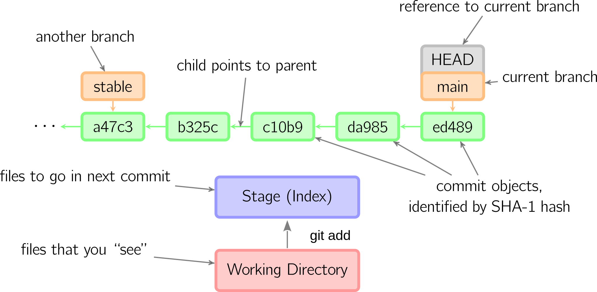
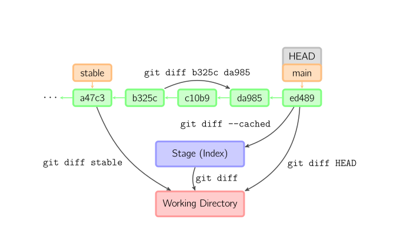
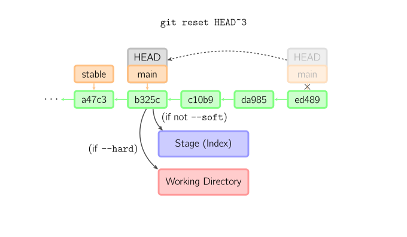
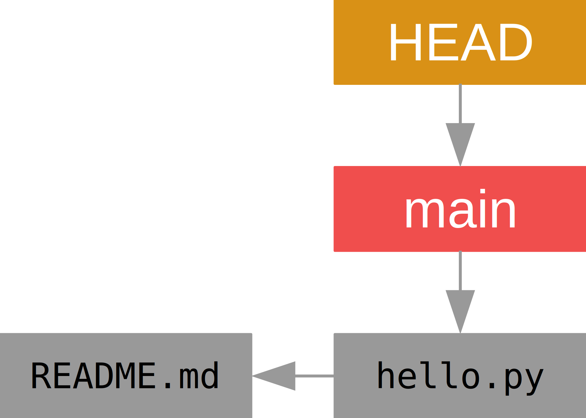
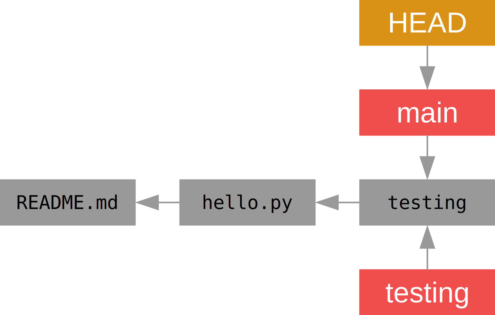
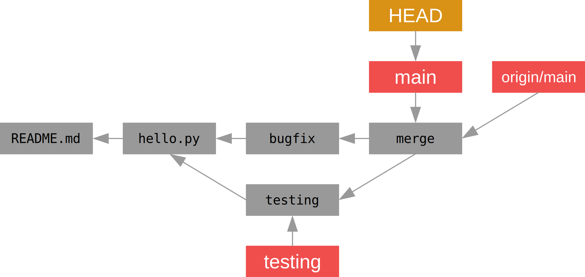
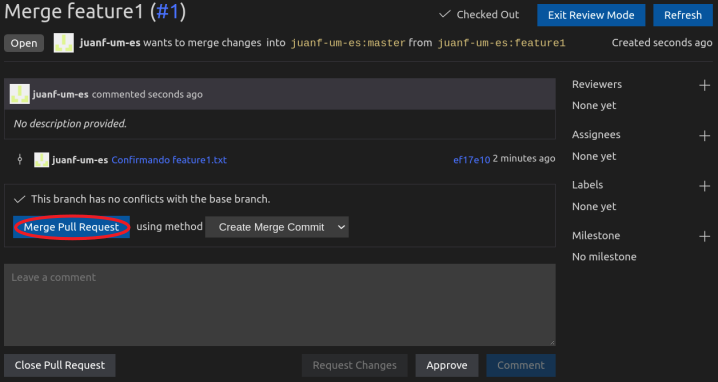
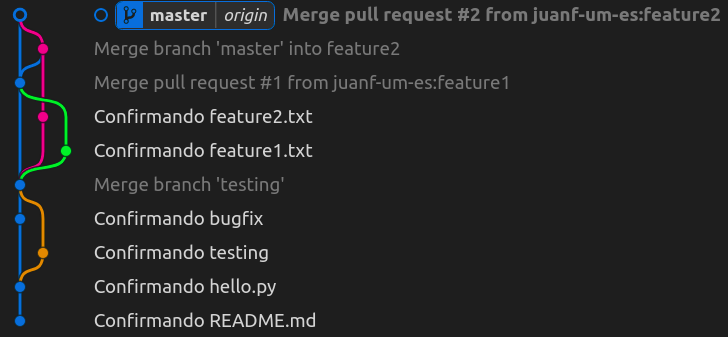

# Tecnologías Específicas en Ingeniería Informática • Tutorial de Git y Github *Workflow*

- [Tecnologías Específicas en Ingeniería Informática • Tutorial de Git y Github *Workflow*](#tecnologías-específicas-en-ingeniería-informática--tutorial-de-git-y-github-workflow)
  - [¿Qué es Git?](#qué-es-git)
  - [Conceptos Básicos](#conceptos-básicos)
    - [Áreas](#áreas)
    - [Estados](#estados)
    - [Objetos](#objetos)
    - [Referencias: Ramas, etiquetas y *commits*](#referencias-ramas-etiquetas-y-commits)
  - [*Workflow* Local](#workflow-local)
    - [Crear un Repositorio](#crear-un-repositorio)
    - [Versionar Nuevos Archivos](#versionar-nuevos-archivos)
    - [Versionar Archivos Existentes](#versionar-archivos-existentes)
    - [Resumen *Workflow* Local](#resumen-workflow-local)
  - [Conceptos Avanzados](#conceptos-avanzados)
    - [*Branching*](#branching)
    - [*Merging*](#merging)
  - [*Workflow* GitHub](#workflow-github)
    - [Crear un Repositorio Remoto](#crear-un-repositorio-remoto)
    - [Clonar un Repositorio Remoto](#clonar-un-repositorio-remoto)
    - [Versionar Archivos en una Rama Local](#versionar-archivos-en-una-rama-local)
    - [Crear y Aplicar un *Pull Request*](#crear-y-aplicar-un-pull-request)
      - [Paso 1: Publicación de la rama `feature1`](#paso-1-publicación-de-la-rama-feature1)
      - [Paso 2: Creación y aplicación de *pull request*](#paso-2-creación-y-aplicación-de-pull-request)
        - [Opción 1: GitHub *website*](#opción-1-github-website)
        - [Opción 2: Visual Studio Code](#opción-2-visual-studio-code)
      - [Paso 3: Actualización de la rama *main* Local](#paso-3-actualización-de-la-rama-main-local)
      - [Paso 4: Eliminar la rama *feature1* Local](#paso-4-eliminar-la-rama-feature1-local)
    - [Crear y Aplicar otro *Pull Request*](#crear-y-aplicar-otro-pull-request)
    - [Actualizar la rama `main` Local](#actualizar-la-rama-main-local)
    - [Eliminar la rama `featureN` Local](#eliminar-la-rama-featuren-local)
    - [Resumen *Workflow* GitHub](#resumen-workflow-github)
  - [Preguntas Frecuentes](#preguntas-frecuentes)
  - [Ejercicios](#ejercicios)
  - [Tarea](#tarea)
  - [Referencias](#referencias)
    - [Básicas](#básicas)
    - [Complementarias](#complementarias)
    - [*Git Internals*](#git-internals)

___

## ¿Qué es Git?

En 2005, Linux Torvalds desarrolló Git como sistema de control de versiones
distribuido (*Distributed Version Control System* of DVCS) para el kernel de
Linux:

- Distribuido: No existe una copia "maestra" del repositorio, sino que cada
  copia contiene toda la información.


- Simple: Mantiene instantáneas o versiones (*snapshots*) de un árbol de
  directorios que contiene objetos.


- Seguro: Cada objeto es referenciado mediante una suma de comprobación,
  *checksum* o *hash* (`SHA-1`). Además, las operaciones sobre el repositorio
  normalmente sólo añaden datos.
- Rápido: La mayor parte de las operaciones sobre el repositorio son locales y
  los objetos están comprimidos.
- Soporte para desarrollo no lineal (miles de ramas) en grandes proyectos.

## Conceptos Básicos

### Áreas

Un **repositorio** es una colección de instantáneas o versiones de un árbol de
directorios en instantes de tiempo definidos por el usuario.


- El directorio de trabajo (*working directory*) es una copia de una instantánea
  o versión del repositorio (*commit*).
- El índice (*staging area*) incluye aquellos archivos que han sido modificados
  y que son candidatos a ser incluidos en la próxima instantánea o
  versión del repositorio.
- El directorio `.git` contiene la base de datos del repositorio, es decir,
  todas las instantáneas o versiones del mismo.

Un **repositorio remoto** es una copia de un repositorio que se encuentra en un
servidor remoto o incluso en el mismo equipo.

### Estados

Los archivos pueden estar en varios estados antes de estar confirmados
(*committed*), es decir, antes de formar parte de una instantánea o versión del
repositorio:


- Ignorado (*untracked*): No forma parte del repositorio y no está en el índice
  para ser incluido en él.
- No modificado (*unmodified*): Forma parte del directorio de trabajo pero no ha
  sido alterado.
- Modificado (*modified*): Forma parte del directorio de trabajo y ha sido
  actualizado.
- Candidato (*staged*): Forma parte del índice (ha sido modificado) y es
  candidato a formar parte de la próxima instantánea o versión del repositorio.
- Confirmado (*committed*): Se incluye en la última instantánea o versión del
  repositorio.

### Objetos

Supongamos que creamos un repositorio, añadimos archivos los `README`, `LICENSE`
y `test.rb` al índice y creamos una nueva instantánea o versión del repositorio
(*commit*). Git genera cinco objetos: tres *blobs*, un *tree* y un *commit*.

- ***Blob***: Archivo comprimido con una cabecera `blob [content_size]\0` seguida
  del contenido de un archivo confirmado.
- ***Tree***: Archivo comprimido con una cabecera `tree [content_size]\0`
  seguida de una lista de *blobs* u otros *trees*. De hecho, representa toda la
  estructura de carpetas de nuestro repositorio Git en un instante dado. El
  *tree* contiene los nombres de los archivos y el *blob* asociado, de manera
  que se puede reconstruir la estructura de directorios del repositorio
  completo.
- ***Commit***: Archivo comprimido con una cabecera `commit [content_size]\0` con
  metadatos sobre el propio *commit* y una referencia a un *tree*.


Si después creamos dos *commits* más, cada *commit* incluye una referencia al
*commit* anterior o padre, creándose un historial de instantáneas o revisiones.


En las figuras se puede observar una cadena de dígitos hexadecimales sobre cada
elemento. Este valor es el resultado de aplicar una función *hash* denominada
SHA-1 sobre cada objeto. Precisamente esta operación es una de las claves del
funcionamiento de los repositorios Git: los objetos se identifican por su
contenido, no por su nombre ni otras características. Un ejemplo para entenderlo
sería el siguiente: supongamos que nos bajamos dos imágenes de Internet y las
dos son la misma imagen con diferente nombre. Obviamente, el tamaño es el mismo
y son iguales byte a byte, la función *hash* para cada una de ellas devuelve el
mismo valor y, por tanto, ambas son el mismo objeto y solamente tenemos que
guardar una de ellas. Por eso a los archivos los llamamos *blobs*, porque
solamente son el contenido de los archivos, sin ningún metadato más.

Por supuesto, podríamos pensar ¿y las colisiones? Pero esa es la magia de una
función *hash* como la SHA-1, que la probabilidad de que dos objetos distintos
produzcan la misma salida se considera en la práctica cero. De esta manera,
mientras un objeto no cambie no necesitamos almacenarlo de nuevo, sino que
podemos guardarlo y referenciarlo por medio de su función SHA-1. Y eso es lo que
se verá constantemente en las ilustraciones y salidas de las órdenes; secuencias
hexadecimales que identifican unívocamente a cada objeto. Por suerte, la mayoría
de las veces no hace falta mostrar los 40 dígitos hexadecimales del
identificador, ya que los 6 o 7 primeros serán suficientes.

Lo anterior junto al hecho de que cada *commit* tenga una referencia al *commit*
del que proviene, permite hacer un seguimiento de los cambios realizados. Al
tener el *commit* también una referencia a un *tree*, lo que tenemos es una
secuencia de instantáneas de nuestro árbol de directorios, por lo que si
queremos volver a cualquier estado anterior, solo tenemos que reconstruir
nuestro repositorio a partir de la información almacenada en el *tree* con los
contenidos de sus *blobs*.

### Referencias: Ramas, etiquetas y *commits*


Una **rama** (*branch*) es un alias o referencia a un *commit* concreto. Las
ramas pueden cambiar con el tiempo conforme se añaden más *commits* al
repositorio. La rama `main` suele ser la rama principal del repositorio. No
obstante, se trata de una convención pues no existe ninguna diferencia con las
demás ramas del repositorio.

Una **etiqueta** (*tag*) también es un alias o una referencia a un *commit*
concreto. A diferencia de las ramas, las etiquetas son inmutables, es decir,
siempre se refieren al mismo *commit*.

La referencia `HEAD` especifica el *commit* del directorio de trabajo en cada
momento. Si se trata de una rama, `HEAD` toma el nombre de la misma. En caso
contrario, es el *hash* del *commit*. Cuando se crea un nuevo *commit*, la
referencia `HEAD` se actualiza.

Un *commit* se puede referenciar mediante su *hash* completo o mediante los
primeros 6 ó 7 caracteres del mismo:

- `HASH~N` se refiere al N-ésimo predecesor del *commit* `hash`.
- `HASH^N` se refiere al N-ésimo padre del *commit* `hash`.

En la figura anterior, tanto `HEAD` como `main` hacen referencia al *commit*
`f30ab`, `HEAD~1` al *commit* `34ac2` y `main~2` al *commit* `98ca9`.

## *Workflow* Local

### Crear un Repositorio

```bash
$ mkdir teii-developer1 && cd "$_"

$ git init
Inicializado repositorio Git vacío en $PWD/.git/

$ ls .git/
branches  config  description  HEAD  hooks  info  objects  refs

$ git mlog
```

### Versionar Nuevos Archivos

Inicialmente, vamos a versionar un único archivo: `README.md`.

```bash
$ echo "# Archivo README.md" > README.md

$ git status
En la rama main

No hay commits todavía

Archivos sin seguimiento:
  (usa "git add <archivo>..." para actualizar lo que se será confirmado)
  README.md
```

`README.md` está en estado "Ignorado".

```bash
$ git add README.md

$ git status
En la rama main

No hay commits todavía

Cambios a ser confirmados:
  (usa "git rm --cached <archivo>..." para sacar del área de stage)
  nuevo archivo:  README.md
```

`README.md` está en estado "Candidato".

```bash
$ git commit -m "Confirmando README.md"
[main (commit-raíz) 0935859] Confirmando README.md
 1 file changed, 1 insertion(+)
 create mode 100644 README.md

$ git status
En la rama main
nada para hacer commit, el árbol de trabajo está limpio
```

`README.md` está en estado "Confirmado/No Modificado".

```bash
$ git mlog
* 0935859 (HEAD -> main) Confirmando README.md

$ git show HEAD
```

Lógicamente, los *hash* de los *commits* (en este caso `0935859...`) no tienen por
qué coincidir con los vuestros, ya que incluyen información acerca del autor del
*commit*, la fecha, etc.

Tras el primer *commit*, la base de datos de Git contiene tres objetos: un
*commit*, un *tree* y un *blob*.

```bash
$ cat .git/HEAD 
ref: refs/heads/main

$ cat .git/refs/heads/main
0935859eb3142b73fab6b512942f884b1925d5f6
```

El *hash* que se muestra es el del *commit* al que apunta la rama *main*, por lo
que podéis ver que comienza por los mismos 7 caracteres que mostraba `git mlog`.
A efectos prácticos no hace falta tener en cuenta todos los caracteres del *hash*,
ya que la probabilidad de que haya dos objetos con el mismo comienzo es muy
baja.

```bash
$ git cat-file commit 0935859
tree 2bda0380fb1e5e78badb4db8ba6d486f085eff0e
author Nombre Apellido1 [Apellido2] <alumno@um.es> TIMESTAMP1
committer Nombre Apellido1 [Apellido2] <alumno@um.es> TIMESTAMP1

Confirmando README.md

$ git ls-tree 2bda0380fb1e5e78badb4db8ba6d486f085eff0e
100644 blob 12b837c8f39dda953115f6795731b9911a4b5bd2 README.md

$ git cat-file blob 12b837c8f39dda953115f6795731b9911a4b5bd2
# Archivo README.md

$ git hash-object README.md
12b837c8f39dda953115f6795731b9911a4b5bd2
```

Aquí podemos ver el identificador que se ha asigando al objeto `README.md` que,
como se indicó al comienzo, es único para cualquier archivo idéntico al nuestro.
La prueba es que todos deberíamos tener la misma salida. Si no es así,
probablemente el contenido del archivo `README.md` es diferente.

Los objetos se almacenan en `.git/objects/`. Por ejemplo:

```bash
$ ls .git/objects/12/
b837c8f39dda953115f6795731b9911a4b5bd2
```

Como habrá tantos objetos diferentes (*blobs*, *trees* y *commits*), éstos se
organizan en directorios cuyo nombre está compuesto por los dos primeros dígitos
del *hash*. De esta manera evitamos que haya demasiados objetos en un mismo
directorio. Además, si un directorio se hiciera muy grande, también se
empaquetarían los objetos de una manera más eficiente.

Como sabemos que cada *commit* tiene una referencia a su padre (o padres, como veremos
más adelante), la referencia `HEAD` es la raíz de un grafo dirigido acíclico cuyos
nodos son *commits*, *trees* y *blobs*:

`HEAD` :arrow_right: `refs/heads/main` :arrow_right: **`commit 0935859`**
:arrow_right: **`tree 2bda03`** :arrow_right: **`blob 12b837`**

### Versionar Archivos Existentes

Ahora, vamos a actualizar el archivo existente y versionar un segundo archivo:
`hello.py`.

<!-- markdownlint-disable MD014 -->
```bash
$ echo -e '#!/usr/bin/env python3\nprint("Hello, TEII!")\n' > hello.py
```
<!-- markdownlint-enable MD014 -->

En este momento, `hello.py` está en estado "Ignorado" y ni `git diff` ni `git diff
--staged` nos devuelven nada.

Sin embargo, si añadimos `hello.py` al índice:

<!-- markdownlint-disable MD014 -->
```bash
$ git add hello.py
```
<!-- markdownlint-enable MD014 -->

`hello.py` pasa al estado "Candidato". La orden `git diff` sigue sin
proporcionarnos información, ya que esa orden nos dice la diferencia entre lo
que se encuentra en el índice y en el directorio de trabajo. De ahí que si
queremos saber algo más, tengamos que usar la opción `--staged` para que nos
muestre las diferencias del índice con respecto al último *commit*.

```bash
$ git diff --staged
diff --git a/hello.py b/hello.py
new file mode 100644
index 0000000..59bc56c
--- /dev/null
+++ b/hello.py
@@ -0,0 +1,3 @@
+#!/usr/bin/env python3
+print("Hello, TEII!")
+
```

Como podemos ver, nos informa de que hay un nuevo archivo con respecto al último
*commit* y marca con `+` las líneas añadidas.

Ahora vamos a añadir contenido al archivo `README.md`, haciendo que pase al
estado "Modificado".

<!-- markdownlint-disable MD013 -->
```bash
$ echo -e 'Contenido: hello.py' >> README.md
$ git status
En la rama main
Cambios a ser confirmados:
  (usa "git restore --staged <archivo>..." para sacar del área de stage)
  nuevo archivo:  hello.py

Cambios no rastreados para el commit:
  (usa "git add <archivo>..." para actualizar lo que será confirmado)
  (usa "git restore <archivo>..." para descartar los cambios en el directorio de trabajo)
  modificado:     README.md
```
<!-- markdownlint-enable MD013 -->

Si ahora hacemos un `git diff` veremos que hay una diferencia entre lo que hay
en el directorio de trabajo y lo que hay en el índice.

```bash
$ git diff
diff --git a/README.md b/README.md
index 12b837c..c567036 100644
--- a/README.md
+++ b/README.md
@@ -1 +1,2 @@
 # Archivo README.md
+Contenido: hello.py
```

Si ahora añadimos al índice el archivo `README.md`, éste pasa a estado
"Candidato". Si volvemos a consultar las diferencias, tendremos que usar
`--staged`.

```bash
$ git add README.md
$ git status
En la rama main
Cambios a ser confirmados:
  (usa "git restore --staged <archivo>..." para sacar del área de stage)
  modificado:     README.md
  nuevo archivo:  hello.py


$ git diff --staged
diff --git a/README.md b/README.md
index 12b837c..c567036 100644
--- a/README.md
+++ b/README.md
@@ -1 +1,2 @@
 # Archivo README.md
+Contenido: hello.py
diff --git a/hello.py b/hello.py
new file mode 100644
index 0000000..59bc56c
--- /dev/null
+++ b/hello.py
@@ -0,0 +1,3 @@
+#!/usr/bin/env python3
+print("Hello, TEII!")
+
```

Si ahora modificásemos de nuevo el archivo `README.md`, veríamos que `git diff`
nos muestra las diferencias entre el índice y el directorio de trabajo, mientras
que `git diff --staged` se refiere a los cambios en el índice con respecto al
último *commit*:

<!-- markdownlint-disable MD013 -->
```bash
$ echo "Línea que no se debe confirmar." >> README.md

$ git status
En la rama main
Cambios a ser confirmados:
  (usa "git restore --staged <archivo>..." para sacar del área de stage)
  modificado:     README.md
  nuevos archivo: hello.py

Cambios no rastreados para el commit:
  (usa "git add <archivo>..." para actualizar lo que será confirmado)
  (usa "git restore <archivo>..." para descartar los cambios en el directorio de trabajo)
  modificado:     README.md

$ git diff
diff --git a/README.md b/README.md
index c567036..ea2c0c1 100644
--- a/README.md
+++ b/README.md
@@ -1,2 +1,3 @@
 # Archivo README.md
 Contenido: hello.py
+Línea que no se debe confirmar.

$ git diff --staged
diff --git a/README.md b/README.md
index 12b837c..c567036 100644
--- a/README.md
+++ b/README.md
@@ -1 +1,2 @@
 # Archivo README.md
+Contenido: hello.py
diff --git a/hello.py b/hello.py
new file mode 100644
index 0000000..59bc56c
--- /dev/null
+++ b/hello.py
@@ -0,0 +1,3 @@
+#!/usr/bin/env python3
+print("Hello, TEII!")
+
```
<!-- markdownlint-enable MD013 -->

Si quisiéramos incorporar este último cambio en `README.md` al índice, usaríamos
`git add README.md`. Sin embargo, queremos descartar el cambio:

```bash
$ git restore README.md

$ git status
En la rama main
Cambios a ser confirmados:
  (usa "git restore --staged <archivo>..." para sacar del área de stage)
  modificado:     README.md
  nuevos archivo: hello.py
```

Ahora vamos a crear un *commit* a partir de lo que se ha guardado en el índice,
por lo que tanto `hello.py` como `README.md` pasarán a estar en el estado
"Confirmado/No Modificado".

```bash
$ git commit -m "Confirmando hello.py"
[main 2c8e405] Confirmando hello.py
 2 files changed, 4 insertions(+)
 create mode 100644 hello.py

$ git status
En la rama main
nada para hacer commit, el árbol de trabajo está limpio

$ git mlog
* 2c8e405 (HEAD -> main) Confirmando hello.py
* 0935859 Confirmando README.md

$ git show HEAD
commit 2c8e405312a299c356f806913e3943df5f2ae330 (HEAD -> main)
Author: lfmaimo <lfmaimo@um.es>
Date:   Sun Apr 11 20:23:09 2021 +0200

    Confirmando hello.py

diff --git a/README.md b/README.md
index 12b837c..c567036 100644
--- a/README.md
+++ b/README.md
@@ -1 +1,2 @@
 # Archivo README.md
+Contenido: hello.py
diff --git a/hello.py b/hello.py
new file mode 100644
index 0000000..59bc56c
--- /dev/null
+++ b/hello.py
@@ -0,0 +1,3 @@
+#!/usr/bin/env python3
+print("Hello, TEII!")
+
```

Después del segundo *commit*, la base de datos de Git contiene cuatro nuevos
objetos: un *commit*, un *tree* y dos *blobs*.

<!-- markdownlint-disable MD013 -->
```bash
$ cat .git/HEAD 
ref: refs/heads/main

$ cat .git/refs/heads/main
2c8e405312a299c356f806913e3943df5f2ae330    # Diferente en cada caso.

$ git cat-file commit 2c8e405312a299c356f806913e3943df5f2ae330
tree 5d7e38e1d0393e9c6cbb4c29062a664d05ec6dea
parent 0935859eb3142b73fab6b512942f884b1925d5f6    # Diferente en cada caso.
author Nombre Apellido1 [Apellido2] <alumno@um.es> TIMESTAMP2
committer Nombre Apellido1 [Apellido2] <alumno@um.es> TIMESTAMP2
...
Confirmando hello.py

$ git ls-tree 5d7e38    # No hace falta poner todo el hash.
100644 blob c567036b09f92c056b3c8dcc31e8fff6278dab6c README.md   # Nótese que el hash de README.md ha cambiado.
100755 blob 59bc56c74e3dfed2010c286c45eaa8c61c5623fd hello.py

$ git cat-file blob c567036
# Archivo README.md
Contenido: hello.py

$ git cat-file blob 59bc56c74e3dfed2010c286c45eaa8c61c5623fd  # Podemos usar el hash entero si queremos.
#!/usr/bin/env python3
print("Hello, TEII!")

$ git hash-object README.md
c567036b09f92c056b3c8dcc31e8fff6278dab6c

$ git hash-object hello.py
59bc56c74e3dfed2010c286c45eaa8c61c5623fd
```
<!-- markdownlint-enable MD013 -->

De nuevo, la referencia `HEAD` es la raíz de un grafo dirigido acíclico cuyos
nodos son *commits*, *trees* y *blobs*:

`HEAD` :arrow_right: `refs/heads/main` :arrow_right: **`commit 2c8e40`**
:arrow_right: **`tree 5d7e38`** :arrow_right: **`blob c56703`** y **`blob
59bc56`**

Los objetos creados anteriormente siguen formando parte de la base de datos de
Git. Por ejemplo:

```bash
$ git cat-file blob 12b837c8f39dda953115f6795731b9911a4b5bd2
# Archivo README.md
```

:warning: Si versionamos archivos de gran tamaño que cambian frecuentemente, el
espacio en disco usado por el repositorio Git aumentará proporcionalmente.

En consecuencia, podemos recrear en el directorio de trabajo cualquier
instantánea o versión del repositorio. Por ejemplo:

```bash
$ git checkout 0935859e

$ git mlog
* 0935859 (HEAD) Confirmando README.md

$ cat README.md
# Archivo README.md

$ git checkout main

$ git mlog
* 2c8e405 (HEAD -> main) Confirmando hello.py
* 0935859 Confirmando README.md
```

### Resumen *Workflow* Local

|       Operación       |                        Semántica                        |
| :-------------------: | :-----------------------------------------------------: |
|         `add`         |      |
| `checkout` / `switch` |  |
|       `commit`        |         |
|        `diff`         |             |
|        `reset`        |     |

## Conceptos Avanzados

Después de las operaciones anteriores, la rama *main* del repositorio
`teii-developer1` tiene dos instantáneas o versiones:



### *Branching*

Dada la figura anterior, creamos una rama para pruebas y realizamos un *commit*
("Confirmando testing"):

<!-- markdownlint-disable MD014 -->
```bash
$ git branch testing
$ git checkout testing ó git switch testing (git >= 2.23)
$ touch testing && git add testing && git commit -m "Confirmando testing"
```
<!-- markdownlint-enable MD014 -->


### *Merging*

El cambio ha resultado satisfactorio por lo que decidimos incorporarlo en la rama
*main* (*fast-forward*):

<!-- markdownlint-disable MD014 -->
```bash
$ git checkout main ó git switch main (git >= 2.23)
$ git merge testing
```
<!-- markdownlint-enable MD014 -->



:pushpin: Se puede revertir la orden `git merge testing` con `git reset --hard
HEAD~1`.

No obstante, podría haberse dado el caso de que antes de decidir incluir la rama
*testing* en la rama *main*, se hubiese realizado otro *commit* ("Confirmando
bugfix") en la rama *main*. En tal caso, se crearía un *commit* con dos padres
(*non fast-forward*), que combinaría el último *commit* de la rama *main* y el
último *commit* de la rama *testing*:

<!-- markdownlint-disable MD014 -->
```bash
$ git checkout main ó git switch main (git >= 2.23)
$ touch bugfix && git add bugfix && git commit -m "Confirmando bugfix"
$ git merge testing
```
<!-- markdownlint-enable MD014 -->


Si durante el proceso hay conflictos que Git no es capaz de resolver, el
usuario tendrá que intervenir, como veremos después.

:warning: Si se produce un conflicto en un archivo binario, tendremos que
decidir cual de las versiones conservamos. Normalmente no es posible combinar
los cambios de las diferentes versiones, ni siquiera manualmente.

## *Workflow* GitHub

Los desarrolladores colaboran en un proyecto mediante un repositorio remoto
compartido siguiendo el patrón que se ilustra a continuación:


### Crear un Repositorio Remoto

```text
github.com • Repositories - New : Repository Name (teii-shared)
                                  Description (Nombre Apellido1 [Apellido2])
                                  Private
```

:warning: El repositorio debe ser privado.

Para crear el repositorio remoto llamado `origin` desde la línea de órdenes a
partir de `teii-developer1`:

<!-- markdownlint-disable MD013 -->
<!-- markdownlint-disable MD014 -->
```bash
$ git remote add origin git@github.com:alumno-um-es/teii-shared.git # git remote add <remote_name> <url>
$ git remote show origin
$ git push --set-upstream origin main # git push <remote_name> <local_branch>
$ git remote show origin
$ git mlog
```
<!-- markdownlint-enable MD014 -->
<!-- markdownlint-enable MD013 -->



### Clonar un Repositorio Remoto

Para *clonar* el repositorio remoto en local desde la línea de órdenes:

<!-- markdownlint-disable MD013 -->
```bash
$ git clone git@github.com:alumno-um-es/teii-shared.git teii-developer2 # git clone <url> <directory>
Cloning into 'teii-developer2'...
```
<!-- markdownlint-enable MD013 -->

:pushpin: Por defecto, `git clone` crea la referencia al repositorio remoto
`origin`.

Nótese que ahora tenemos dos copias del repositorio remoto, `teii-developer1` y
`teii-developer2`.

### Versionar Archivos en una Rama Local

Supongamos que dos desarrolladores, `developer1` y `developer2` trabajan en la
implementación de funcionalidad adicional. En concreto, `developer1` y
`developer2` desarrollan `feature1` y `feature2` en `teii-developer1` y
`teii-developer2`, respectivamente.

<!-- markdownlint-disable MD013 -->
| :small_red_triangle_down: `teii-developer1`      | :small_red_triangle_down: `teii-developer2`      |
| :----------------------------------------------- | :----------------------------------------------- |
| `git switch main`                                | `git switch main`                                |
| `git branch feature1`                            | `git branch feature2`                            |
| `git switch feature1`                            | `git switch feature2`                            |
| `echo -e 'feature1' > feature1.txt`              | `echo -e 'feature2' > feature2.txt`              |
| `echo -e 'Contenido: feature1.txt' >> README.md` | `echo -e 'Contenido: feature2.txt' >> README.md` |
| `git add feature1.txt README.md`                 | `git add feature2.txt README.md`                 |
| `git commit -m "Confirmando feature1.txt"`       | `git commit -m "Confirmando feature2.txt"`       |
| `git mlog`                                       | `git mlog`                                       |
<!-- markdownlint-enable MD013 -->

### Crear y Aplicar un *Pull Request*

Después de realizar los tests unitarios y de integración, el desarrollador
`developer1` decide publicar la rama *feature1* en el repositorio remoto
`teii-shared` e incorporar los cambios en la rama *main*.

#### Paso 1: Publicación de la rama `feature1`

:small_red_triangle_down: `teii-developer1`

```bash
$ git push --set-upstream origin feature1
...
remote: Create a pull request for 'feature1' on GitHub by visiting:
remote:      https://github.com/alumno-um-es/teii-shared/pull/new/feature1
To github.com:alumno-um-es/teii-shared.git
 * [new branch]      feature1 -> feature1
```

#### Paso 2: Creación y aplicación de *pull request*

##### Opción 1: GitHub *website*

:small_red_triangle_down: `teii-developer1`

Al acceder al enlace que aparece arriba, se puede crear un *pull request*,
petición de incorporación de cambios o *merge*, desde la rama *feature1* hasta
la rama *main*. Por defecto, esta operación no requiere permisos adicionales
si no hay conflictos. En producción, normalmente se necesita la revisión y
aceptación de los cambios por parte de uno o más desarrolladores.


Cuando el *pull request* está listo para ser aplicado, hay tres opciones:

- *Create a merge commit* (por defecto)
- *Squash and merge*
- *Rebase and merge*

En nuestro caso, utilizaremos la opción por defecto.

##### Opción 2: Visual Studio Code

:warning: Require la extensión *GitHub Pull Requests and Issues*.




:pushpin: En cualquiera de las dos opciones, se crea un *commit* `Merge pull
request #1`.

#### Paso 3: Actualización de la rama *main* Local

#### Paso 4: Eliminar la rama *feature1* Local

### Crear y Aplicar otro *Pull Request*

:small_red_triangle_down: `teii-developer2`

A su vez, tras realizar los tests unitarios y de integración, el desarrollador
`developer2` decide publicar la rama *feature2* en el repositorio remoto
`teii-shared` e incorporar los cambios en la rama *main*.

<!-- markdownlint-disable MD014 -->
```bash
$ git push --set-upstream origin feature2
```
<!-- markdownlint-enable MD014 -->

En este caso, se produce un conflicto porque también ha modificado el archivo
`README.md`. En cualquiera de las dos opciones anteriores, se muestra el
mensaje "*This branch has conflicts that must be resolved.*". Para resolver el
conflicto:

- Integramos los cambios de la rama *feature1* que ya están presentes en la rama
  *main*:

  <!-- markdownlint-disable MD013 -->
  ```bash
  $ git switch main
  $ git pull
  $ git switch feature2

  $ git merge main
  Auto-fusionando README.md
  CONFLICTO (contenido): Conflicto de fusión en README.md
  Fusión automática falló; arregle los conflictos y luego realice un commit con el resultado.

  $ cat README.md
  # Archivo README.md
  Contenido: hello.py
  <<<<<<< HEAD
  Contenido: feature2.txt
  =======
  Contenido: feature1.txt
  >>>>>>> main
  ```
  <!-- markdownlint-enable MD013 -->

- Editamos el archivo `README.md`:

  ```bash
  $ cat README.md
  # Archivo README.md
  Contenido: hello.py
  Contenido: feature1.txt
  Contenido: feature2.txt

  $ git add README.md
  $ git commit
  $ git push --set-upstream origin feature2
  ```

- Aplicamos el *pull request* igual que en el caso anterior que crea un *commit*
`Merge pull request #2`.

### Actualizar la rama `main` Local

:small_red_triangle_down: `teii-developer1` y `teii-developer2`

<!-- markdownlint-disable MD014 -->
```bash
$ git switch main # featureN > main
$ git pull # git fetch + git merge origin/main
$ git mlogall
```
<!-- markdownlint-enable MD014 -->

### Eliminar la rama `featureN` Local

:small_red_triangle_down: `teii-developer1` y `teii-developer2`

Al haber incorporado los cambios de la rama *featureN* en la rama *main*, la
primera ya no es necesaria y, por tanto, puede eliminarse con:

<!-- markdownlint-disable MD014 -->
```bash
$ git branch                        # Ramas main y featureN
$ git branch -d featureN            # Eliminación rama local
$ git branch                        # Rama main
$ git branch -r                     # Ramas origin/main y origin/featureN
$ git push --delete origin featureN # Eliminación rama remota
$ git remote prune origin           # Eliminación referencias locales a ramas remotas
$ git branch -r                     # Rama origin/main
```
<!-- markdownlint-enable MD014 -->

La eliminación se puede automatizar en cualquiera de las dos opciones
anteriores del paso 2 explicadas anterioremente.

Al completar los cambios anteriores, el contenido de la base de datos de Git
es el siguiente tanto en `teii-developer1` como en `teii-developer2`:



### Resumen *Workflow* GitHub


## Preguntas Frecuentes

<!-- markdownlint-disable MD014 -->

- ¿Cómo recupero un archivo eliminado por error?:

```bash
$ rm hello.py
$ git status
$ git checkout -- hello.py ó git restore hello.py (git >= 2.23.0)
$ git status
```

- ¿Cómo elimino un archivo del índice?:

```bash
$ touch error
$ git add error
$ git status
$ git reset HEAD error ó git restore --staged error (git >= 2.23.0)
$ git status
```

- ¿Cómo descarto los cambios en un archivo?:

```bash
$ echo "cambio erroneo" >> hello.py
$ git status
$ git checkout HEAD hello.py ó git restore hello.py (git >= 2.23.0)
$ git status
```

- ¿Cómo es posible que un archivo esté modificado y sea candidato a la vez?

  Cuando un archivo es modificado después de haber sido postulado como
  candidato, el archivo está tanto en el estado modificado como en el estado
  candidato.

```bash
$ echo "primer cambio" > dual
$ git add dual
$ echo "segundo cambio" >> dual
$ git status
```

- ¿Cómo elimino o renombro un archivo?

  Con [`git rm`](https://git-scm.com/docs/git-rm) se puede eliminar un archivo,
  mientras que con [`git mv`](https://git-scm.com/docs/git-mv) es posible
  renombrarlo.

- ¿Cómo añado/elimino un archivo al/del último *commit* **local**?:

```bash
$ git commit -m 'último commit'
$ git add missing.txt
$ git commit --amend
$ git rm unneeded.txt
$ git commit --amend
$ git show HEAD
```

- ¿Cómo corrijo el mensaje del último *commit* **local**?:

```bash
$ git commit --amend
$ git show HEAD
```

- ¿Cómo descarto el último *commit* **local**?:

```bash
$ git add error
$ git commit -m 'commit erróneo'
$ git mlog
$ git reset HEAD~
$ git mlog
$ git status
```

- ¿Cómo descarto el último *commit* **remoto**?

  Con [`git revert HASH`](https://git-scm.com/docs/git-revert) se puede crear un
  *commit* que *deshaga* el *commit* **local** `HASH`.

- ¿Cómo puedo hacer que Git ignore ciertos archivos, es decir, que no
  aparezcan como ignorados con `git status`?

  El archivo [`.gitignore`](https://git-scm.com/docs/gitignore) permite hacer
  que Git no procese ciertos patrones de archivos.

<!-- markdownlint-enable MD014 -->

## Ejercicios

:warning: Los ejercicios han de realizarse en orden.

- Añade un nuevo archivo versionado llamado `ejercicio.txt` cuyo contenido
  sea `Ejercicio TEII` y actualiza `README.md`, con el *workflow* local en
  `teii-developer1`. La rama debe llamarse `ejercicio`.

- Determina los valores C/T/B en `HEAD` :arrow_right:
  `refs/heads/main` :arrow_right: **`commit C`** :arrow_right: **`tree T`** y
  :arrow_right: **`blob B`**.

- Renombra `hello.py` como `hello_teii.py` y actualiza `README.md`, con el
  *workflow* local en `teii-developer2`. La rama debe llamarse `hellow_teii`.

- Determina los valores C/T/B en `HEAD` :arrow_right:
  `refs/heads/main` :arrow_right: **`commit C`** :arrow_right: **`tree T`** y
  :arrow_right: **`blob B`**.

- Crea y aplica un *pull request* en `teii-developer1` a partir de la rama
  `ejercicio`.

- Crea y aplica un *pull request* en `teii-developer2` a partir de la rama
  `hello_teii`. Resuelve los posibles conflictos tal y como se mostró
  anteriormente.

- Actualiza la rama *main* tanto en `teii-developer1` como en
  `teii-developer2`.

- Elimina las ramas `ejercicio` y `hello_teii` junto con todas sus
  referencias en ambos repositorios.

- Elimina `ejercicio.txt` del repositorio con el *workflow* GitHub en
  `teii-developer1`. La rama debe llamarse `borrado`.

- Actualiza la rama *main* tanto en `teii-developer1` como en
  `teii-developer2`.

## Tarea

- Clona el repositorio remoto `teii-alumno` en local desde la línea de
  órdenes o desde Visual Studio Code.

- Crea el fichero `GRUPO.md` en el repositorio `teii-alumno` desde la línea
de órdenes:

<!-- markdownlint-disable MD013 -->
<!-- markdownlint-disable MD014-->
```bash
$ cd teii-alumno
$ echo -e "# TEII\n\n- Nombre Apellido1 [Apellido2]" > GRUPO.md  # Primer alumno miembro del grupo
$ git add GRUPO.md
$ git commit -m "Creación de GRUPO.md"
$ git push --set-upstream origin main
```
<!-- markdownlint-enable MD014-->
<!-- markdownlint-enable MD013 -->

- Modifica el fichero `GRUPO.md` en el repositorio `teii-alumno` desde
Visual Studio Code:

<!-- markdownlint-disable MD013 -->
```text
Visual Studio Code • EXPLORADOR : Edit (Añade el segundo miembro del grupo a GRUPO.md)
Visual Studio Code • CONTROL DE CÓDIGO FUENTE : Add / Commit / Push ("Modificación de GRUPO.md")
```
<!-- markdownlint-enable MD013 -->

:warning: Verifica en `github.com` que los dos *commits* han sido actualizados
en el repositorio remoto con éxito.

## Referencias

### Básicas

- git-scm.com • Pro Git Book by Scott Chacon and Ben Straub [[HTML](https://www.git-scm.com/book/en/v2)|[PDF](https://github.com/progit/progit2/releases/download/2.1.300/progit.pdf)|[EPUB](https://github.com/progit/progit2/releases/download/2.1.300/progit.epub)]
  - [2.2 Git Basics - Recording Changes to the Repository](https://www.git-scm.com/book/en/v2/Git-Basics-Recording-Changes-to-the-Repository)
  - [2.3 Git Basics - Viewing the Commit History](https://www.git-scm.com/book/en/v2/Git-Basics-Viewing-the-Commit-History)
  - [2.4 Git Basics - Undoing Things](https://www.git-scm.com/book/en/v2/Git-Basics-Undoing-Things)
  - [2.5 Git Basics - Working with Remotes](https://www.git-scm.com/book/en/v2/Git-Basics-Working-with-Remotes)
  - [3.1 Git Branching - Branches in a Nutshell](https://www.git-scm.com/book/en/v2/Git-Branching-Branches-in-a-Nutshell)
  - [3.2 Git Branching - Basic Branching and Merging](https://www.git-scm.com/book/en/v2/Git-Branching-Basic-Branching-and-Merging)
  - [3.5 Git Branching - Remote Branches](https://www.git-scm.com/book/en/v2/Git-Branching-Remote-Branches)
  - [3.6 Git Branching - Rebasing](https://www.git-scm.com/book/en/v2/Git-Branching-Rebasing)

- [git-scm.com • *Reference*](https://git-scm.com/docs)
- github.com • *git cheat sheet* [[HTML](https://training.github.com/downloads/github-git-cheat-sheet/)|[PDF](https://training.github.com/downloads/github-git-cheat-sheet.pdf)]
- [Visual Git CheatSheet](https://ndpsoftware.com/git-cheatsheet.html)

### Complementarias

- [Bitbucket Tutorial • Merging vs. Rebasing](https://www.atlassian.com/git/tutorials/merging-vs-rebasing)
- [Bitbucket Tutorial • Resetting, Checking Out and Reverting](https://www.atlassian.com/git/tutorials/resetting-checking-out-and-reverting)
- [The GitHub Blog • How to undo (almost) anything with Git](https://github.blog/2015-06-08-how-to-undo-almost-anything-with-git/)
- [A Visual Git Reference by Mark Lodato](http://marklodato.github.io/visual-git-guide/index-en.html)
- [Git Tutorial by Lars Vogel](https://www.vogella.com/tutorials/Git/article.html)

### *Git Internals*

- [git-scm.com • Pro Git Book by Scott Chacon and Ben Straub](https://www.git-scm.com/book/en/v2)
  - [10.1 Git Internals](https://www.git-scm.com/book/en/v2/Git-Internals-Plumbing-and-Porcelain)
- Git Internals by Scott Chacon [[PDF](https://github.com/pluralsight/git-internals-pdf/raw/master/drafts/peepcode-git.pdf)]
- [Git from the Bottom Up by John Wiegley](https://jwiegley.github.io/git-from-the-bottom-up/)
- [YouTube • GitLab Git Internals - How Git Works - Fear Not The SHA!](https://www.youtube.com/watch?v=P6jD966jzlk&list=RDCMUCnMGQ8QHMAnVIsI3xJrihhg)
