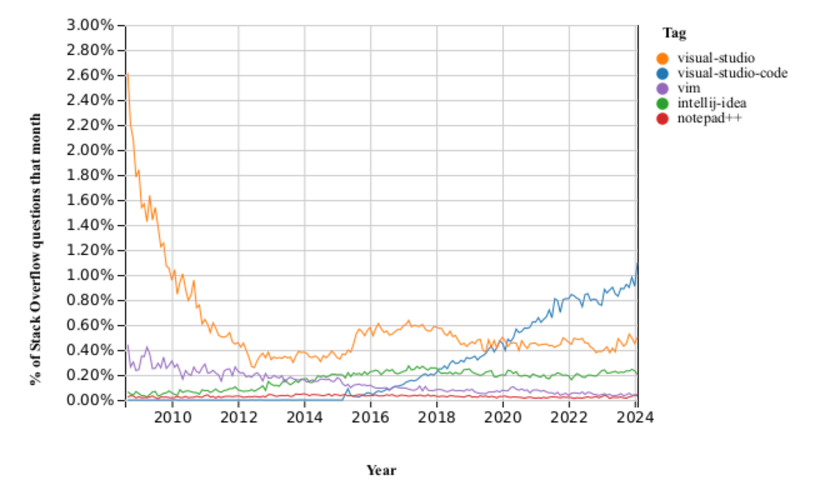
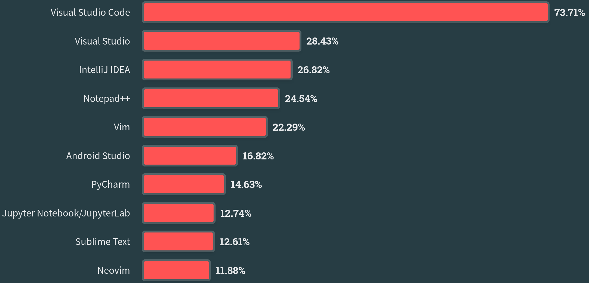
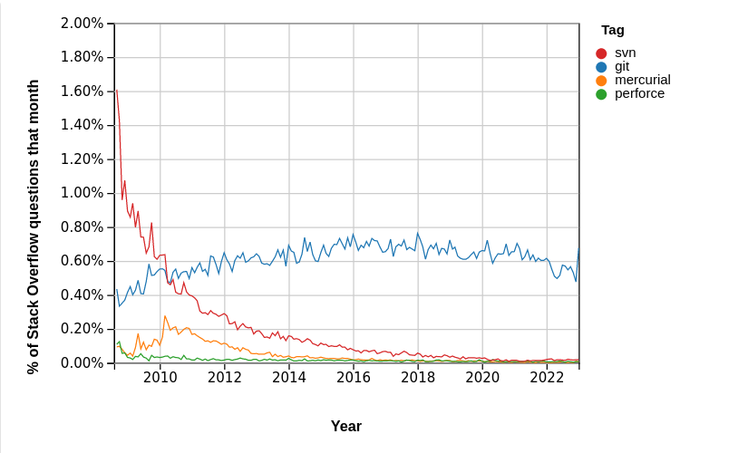
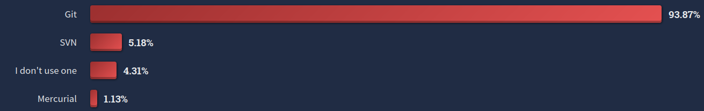
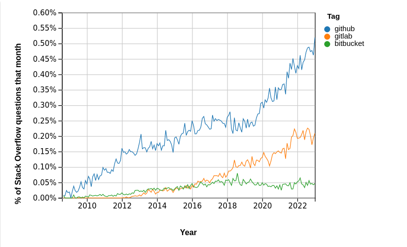
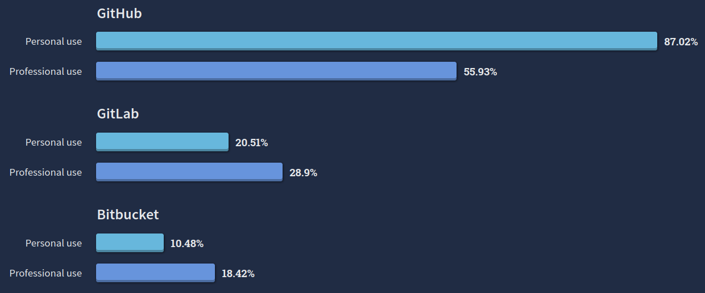
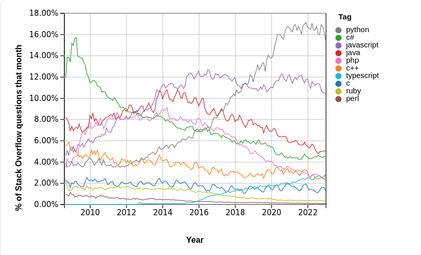
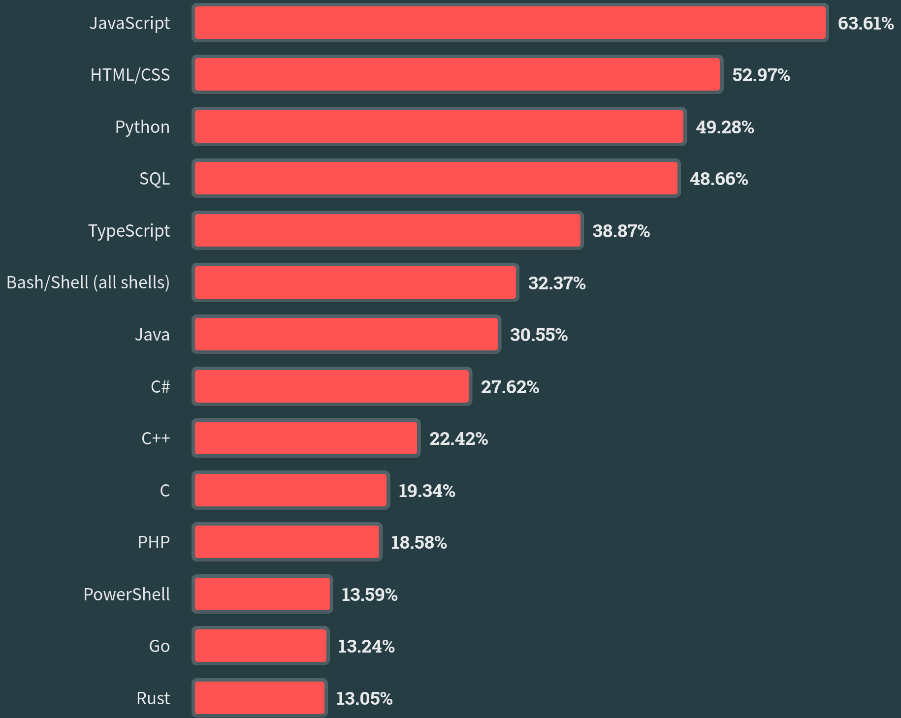

<!-- markdownlint-disable MD013 -->
# Tecnologías Específicas en Ingeniería Informática • Presentación Bloques III y IV
<!-- markdownlint-enable MD013 -->

- [Tecnologías Específicas en Ingeniería Informática • Presentación Bloques III y IV](#tecnologías-específicas-en-ingeniería-informática--presentación-bloques-iii-y-iv)
  - [Contenidos](#contenidos)
    - [Desarrollo de una Aplicación Sencilla con CI/CD](#desarrollo-de-una-aplicación-sencilla-con-cicd)
    - [¿Por qué Visual Studio Code?](#por-qué-visual-studio-code)
      - [Stack Overflow Trends - Integrated Development Environment](#stack-overflow-trends---integrated-development-environment)
      - [Stack Overflow Survey - Technology - Integrated Development Environment](#stack-overflow-survey---technology---integrated-development-environment)
    - [¿Por qué `git`?](#por-qué-git)
      - [Stack Overflow Trends - Version Control](#stack-overflow-trends---version-control)
      - [Stack Overflow Survey - Technology - Version Control Systems](#stack-overflow-survey---technology---version-control-systems)
    - [¿Por qué GitHub?](#por-qué-github)
      - [Stack Overflow Trends - Version Control Platforms](#stack-overflow-trends---version-control-platforms)
      - [Stack Overflow Survey - Techology - Version Control Platforms](#stack-overflow-survey---techology---version-control-platforms)
    - [¿Por qué Python?](#por-qué-python)
      - [Stack Overflow Trends - Programming, Scripting, and Markup Languages](#stack-overflow-trends---programming-scripting-and-markup-languages)
      - [Stack Overflow Survey - Programming, Scripting, and Markup Languages](#stack-overflow-survey---programming-scripting-and-markup-languages)
  - [Contenidos, planificación y profesorado](#contenidos-planificación-y-profesorado)
  - [Evaluación](#evaluación)
  - [Preguntas Frecuentes](#preguntas-frecuentes)
  - [Referencias](#referencias)

## Contenidos

### Desarrollo de una Aplicación Sencilla con CI/CD

En la industria, el desarrollo de software suele llevarlo a cabo un equipo de
varios profesionales que trabajan en nuevas características de un componente
software, o en mejoras de las ya existentes, de manera simultánea. La nueva
funcionalidad debe integrarse y probarse antes de generar una nueva versión de
dicho componente software. Tradicionalmente, este proceso era poco frecuente y,
en consecuencia, no sólo tedioso sino también arduo, lento y complejo. **CI/CD**
es una estrategia de desarrollo de software empleada en la industria que
consiste en integrar, probar y publicar un componente software a partir los
cambios de los desarrolladores, con frecuencia y de manera automatizada.

- ***Continuous Integration* (CI)**: Proceso que detecta cambios en un
  repositorio de código fuente, obtiene una copia del mismo, y ejecuta una
  secuencia de tests unitarios, de integración o de otra índole.

- ***Continuous Delivery* (CD)**: Proceso que genera una nueva versión del
  componente software a partir del paso anterior si todos los tests fueron
  satisfactorios. El producto resultante suele ser un archivo ejecutable, un
  paquete o módulo que se puede instalar o importar, o una imagen `docker`.

Para poder utilizar esta estrategia de desarrollo de software resultan
imprescindibles un sistema de control de versiones, que permita integrar todos
los cambios de forma sencilla, un conjunto de tests, que valide el componente
software exhaustivamente (tanto la funcionalidad existente como la nueva), y una
plataforma que permita automatizar todo el proceso.

En esta asignatura, ilustraremos como aplicar CI/CD para extender un componente
software sencillo que incluye un conjunto de tests unitarios y que se distribuye
como un paquete **Python**. Para ello, usaremos **`git`** como sistema de
control de versiones y **GitHub** como plataforma para la automatización de
CI/CD. Como entorno de desarrollo utilizaremos **Visual Studio Code**.

### ¿Por qué Visual Studio Code?

#### Stack Overflow Trends - Integrated Development Environment

Porcentaje de preguntas en Stack Overflow con las etiqueas
`visual-studio-code`, `visual-studio`, `intellij`, `notepad` o `vim`:

.

#### Stack Overflow Survey - Technology - Integrated Development Environment

Visual Studio Code es el IDE preferido por los desarrolladores:

### ¿Por qué `git`?

#### Stack Overflow Trends - Version Control

Porcentaje de preguntas en Stack Overflow con las etiquetas `git`, `mercurial`,
`perforce` o `svn`:

#### Stack Overflow Survey - Technology - Version Control Systems

La mayoría de los desarrolladores utiliza Git como sistema de control de
versiones:

### ¿Por qué GitHub?

#### Stack Overflow Trends - Version Control Platforms

Porcentaje de preguntas en Stack Overflow con las etiquetas `github`, `gitlab` o
`bitbucket`:

#### Stack Overflow Survey - Techology - Version Control Platforms

Con diferencia, GitHub es la plataforma de control de versiones más utilizada:

### ¿Por qué Python?

#### Stack Overflow Trends - Programming, Scripting, and Markup Languages

Porcentaje de preguntas en Stack Overflow con las etiquetas `c`, `c++`, `c#`,
`java`, `javascript`, `perl`, `php`, `python`, `ruby` o `typescript`:

#### Stack Overflow Survey - Programming, Scripting, and Markup Languages

El 49,28% de los desarrolladores que cumplimentaron la encuesta utiliza Python:

## Contenidos, planificación y profesorado

Cada uno de los bloques tiene una duración de tres semanas y sus contenidos son
los siguientes:

- **Bloque III**: Tutoriales de Git, *workflow* de GitHub, Python y análisis de
  datos en Python con el paquete Pandas.
- **Bloque IV**: Extensión de un componente software sencillo escrito en Python
  con Pandas mediante el *workflow* de GitHub.

El carácter eminentemente práctico de los bloques III y IV de la asignatura hace
que se siga la misma metodología docente en todas las sesiones presenciales sin
distinción entre teoría y prácticas, ya que será necesario el uso del ordenador
por parte del alumno para ir siguiendo el desarrollo de la clase. Por este
motivo, la **clase de teoría de los jueves tendrá lugar en el laboratorio 2.6 de
la Facultad de Informática** en vez de en el aula A.01 del Aulario Norte, a
partir del jueves 14 de marzo. Las **sesiones de prácticas de martes y
miércoles no cambian de ubicación**, es decir, seguirán impartiéndose en el
laboratorio 2.1.

Ambos bloques serán impartidos por **Juan Fernández Peinador**:

- Tutorías presenciales (con cita previa): Viernes: 9:00-10:30, despacho 3.32
  FIUM.
- Tutorías virtuales: Mensaje por el AV o Zoom.

## Evaluación

La evaluación de esta parte de la signatura consiste en una única tarea que
incluye:

- [**2,0 puntos**] Ejercicios de programación Python básicos (incluyendo
  Programación Orientada a Objectos).
- [**8,0 puntos**] Extensión de un paquete Python para análisis de datos
  bursátiles siguiendo la estrategia CI/CD.

Para la realización y entrega de la tarea se formarán **grupos de prácticas de
dos alumnos**.

La fecha límite para la entrega de la tarea es el **21 de mayo**.

Para superar esta parte de la asignatura hay que obtener una **calificación \>=
5**.

## Preguntas Frecuentes

- **¿Qué infraestructura necesito para esta asignatura?**
  
  Tanto las clases, teóricas o prácticas, como la tarea de los bloques III y IV
  requieren una instalación nativa o una máquina virtual de **Ubuntu 22.04
  LTS**.

  Una máquina virtual para VirtualBox de [**Xubuntu 22.04
  LTS**](https://xubuntu.org/) está disponible en formato OVA (enlace disponible
  en el Aula Virtual). Esta máquina virtual es similar a Ubuntu 22.04 LTS pero
  necesita menos recursos (2 GB de memoria y ~20 GB de disco). Su instalación
  requiere tanto VirtualBox como VirtualBox *Extension Pack* que se pueden
  obtener [aquí](https://www.virtualbox.org/wiki/Downloads). El usuario es
  `alumno` y su clave `alumno`.

  Para visualizar la documentación, distribuida en formato Markdown, y editar,
  probar y extender el código de la tarea se usará una versión *portable* de
  Visual Studio Code que también estará disponible en formato contenedor
  (enlace disponible en el Aula Virtual).

- **¿No puedo seguir las clases y realizar la tarea en Fedora, Mac OS o Windows?**

  Sí, ambas cosas se pueden hacer en Fedora (u otra distribución de Linux), Mac
  OS o incluso en Windows con WSL. No obstante, el alumno es responsable de la
  configuración de todas las herramientas necesarias en esos entornos.

- **¿No puedo desarrollar y entregar la tarea individualmente?**

  La realización de la tarea debería involucrar a un grupo de dos alumnos porque
  uno de los objetivos principales del bloque IV es extender la funcionalidad de
  un componente software siguiendo un *workflow* usado en la industria para
  trabajo en equipo. Por ello, se recomienda encarecidamente que forméis grupos
  de prácticas de dos alumnos. Aún así, si por cualquier motivo no fuese
  posible, se admitirá la entrega de la tarea de maneras individual. No obstante,
  téngase en cuenta que la carga de trabajo y los criterios de evaluación serán
  idénticos independientemente de la composición del grupo de prácticas.

## Referencias

- [opensource.com • What is CI/CD?](https://opensource.com/article/18/8/what-cicd)
- [RedHat • DevOps - What is CI/CD?](https://www.redhat.com/en/topics/devops/what-is-ci-cd)

- [Stack Overflow Trends](https://insights.stackoverflow.com/trends):
  Estadísticas sobre etiquetas en preguntas en Stack Overflow.
  - [Stack Overflow Trends • Integrated Development Environments](https://insights.stackoverflow.com/trends?tags=visual-studio-code%2Cvisual-studio%2Cintellij-idea%2Cnotepad%2B%2B%2Cvim)
  - [Stack Overflow Trends • Version Control Systems](https://insights.stackoverflow.com/trends?tags=git%2Cmercurial%2Cperforce%2Csvn)
  - [Stack Overflow Trends • Collaboration Tools](https://insights.stackoverflow.com/trends?tags=github%2Cgitlab%2Cbitbucket)
  - [Stack Overflow Trends • Programming Languages](https://insights.stackoverflow.com/trends?tags=c%2Cc%2B%2B%2Cc%23%2Cjava%2Cjavascript%2Cperl%2Cphp%2Cpython%2Cruby%2Ctypescript)

- [Stack Overflow Developer Survey'22](https://survey.stackoverflow.co/2022/):
  Encuesta a ~70000 desarrolladores de 180 países realizada en Mayo-Junio de 2022.
  - [Stack Overflow Developer Survey'22 • Technology • Version Control Systems](https://survey.stackoverflow.co/2022/#section-version-control-version-control-systems)
  - [Stack Overflow Developer Survey'22 • Technology • Collaboration Tools](https://survey.stackoverflow.co/2022/#section-version-control-version-control-platforms)

- [Stack Overflow Developer Survey'23](https://survey.stackoverflow.co/2023/):
  Encuesta a ~90000 desarrolladores de 185 países en Mayo de 2023.
  - [Stack Overflow Developer Survey'23 • Tecnology • Integrated Development Environments](https://survey.stackoverflow.co/2023/#section-most-popular-technologies-integrated-development-environment)
  - [Stack Overflow Developer Survey'23 • Tecnology • Programming, Scripting and Markup Languages](https://survey.stackoverflow.co/2023/#section-most-popular-technologies-programming-scripting-and-markup-languages)
