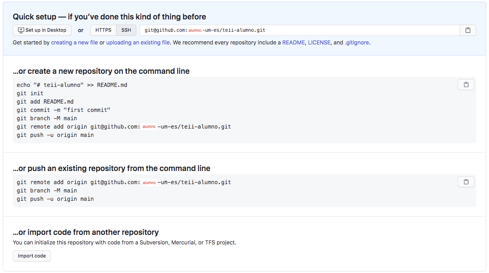

# Tecnologías Específicas en Ingeniería Informática • Configuración de GitHub

- [Tecnologías Específicas en Ingeniería Informática • Configuración de GitHub](#tecnologías-específicas-en-ingeniería-informática--configuración-de-github)
  - [Creación de una cuenta en GitHub](#creación-de-una-cuenta-en-github)
  - [Configuración del acceso a GitHub](#configuración-del-acceso-a-github)
    - [SSH](#ssh)
    - [Personal Access Token (PAT)](#personal-access-token-pat)
  - [Creación de un repositorio para TEII en GitHub](#creación-de-un-repositorio-para-teii-en-github)
  - [Clonación del repositorio de TEII en GitHub](#clonación-del-repositorio-de-teii-en-github)
    - [SSH](#ssh-1)
    - [PAT](#pat)
    - [Visual Studio Code](#visual-studio-code)
  - [Compartición del repositorio de TEII en GitHub](#compartición-del-repositorio-de-teii-en-github)
  - [Referencias](#referencias)
    - [GitHub](#github)
    - [GitHub y Markdown](#github-y-markdown)
    - [GitHub y Visual Studio Code](#github-y-visual-studio-code)
    - [Alternativas a GitHub](#alternativas-a-github)

___

## Creación de una cuenta en GitHub

Accede a
[github.com • SignUp](https://github.com/join?ref_cta=Sign+up&ref_loc=header+logged+out&ref_page=%2F&source=header-home)
y crea una cuenta con tu nombre, apellidos y **dirección de correo electrónico
de la UMU**.

:warning: Si tu dirección de correo electrónico es
`alumno.apellido1[.apellido2]@um.es`, el nombre de usuario debe ser
`alumno-apellido1-[apellido2-]um-es`. Por simplicidad, en este documento se
usará `alumno@um.es`.

A continuación, establece tu nombre y apellido(s) en GitHub:

```text
github.com • Settings : Public Profile : Name : Nombre Apellido1 [Apellido2]
```

Por último, actualiza tu nombre de usuario en GitHub:

```text
github.com • Settings : Account : Change username : alumno1-apellido1-[apellido2-]um-es
```

## Configuración del acceso a GitHub

### SSH

Generación de una nueva clave para SSH:

```bash
$ ssh-keygen -t ed25519 -C "alumno@um.es" -f "$HOME/.ssh/github_ed25519"
Generating public/private ed25519 key pair.
Enter passphrase (empty for no passphrase): 
Enter same passphrase again: 
Your identification has been saved in /home/alumno/.ssh/github_ed25519
Your public key has been saved in /home/alumno/.ssh/github_ed25519.pub
The key fingerprint is:
SHA256:... alumno@um.es
The key randomart image is:
+--[ED25519 256]--+
|       ...       |
+----[SHA256]-----+
```

:pushpin: Si tu sistema no soporta `-t ed25519`, utiliza `-t rsa -b 4096`.

Inclusión de la clave generada en el agente SSH (sólo necesario si se creó una
*passphrase* en el paso anterior):

```bash
$ eval "$(ssh-agent -s)"

$ ssh-add ~/.ssh/github_ed25519
Enter passphrase for /home/alumno/.ssh/github_ed25519: 
Identity added: /home/alumno/.ssh/github_ed25519 (alumno@um.es)
```

Recuperación de la clave pública generada:

```bash
$ cat $HOME/.ssh/github_ed25519.pub
ssh-ed25519 ... alumno@um.es     <----- Copia esta línea
```

Inclusión de la clave pública en GitHub:

<!-- markdownlint-disable MD013 -->
```text
github.com • Settings : SSH and PGP Keys : New SSH Key : Add SSH Key (Pega la línea anterior)
```
<!-- markdownlint-enable MD013 -->

Comprobación de la configuración de acceso a GitHub con SSH:

<!-- markdownlint-disable MD013 -->
```bash
$ ssh -T git@github.com
The authenticity of host 'github.com (IP_ADDRESS)' cannot be established.
ED25519 key fingerprint is SHA256:...
Are you sure you want to continue connecting (yes/no/[fingerprint])? yes
Warning: Permanently added 'github.com (IP_ADDRESS)' (ED25519) to the list of known hosts.
Hi alumno-um-es! You have successfully authenticated, but GitHub does not provide shell access.
```
<!-- markdownlint-enable MD013 -->

La huella digital o *fingerprint* debe coincidir con la [huella digital de
GitHub](https://docs.github.com/en/github/authenticating-to-github/githubs-ssh-key-fingerprints).

:warning: Sin trabajas en un laboratorio, al terminar la sesión no olvides
eliminar `.ssh/github_ed25519` y `.ssh/github_ed25519.pub`, así cómo borrar la
SSH Key correspondiente configurada anteriormente en tu cuenta de GitHub.

### Personal Access Token (PAT)

Genera un token de acceso personal siguiendo
[estas instrucciones](https://docs.github.com/es/authentication/keeping-your-account-and-data-secure/creating-a-personal-access-token).

<!-- markdownlint-disable MD013 -->
```text
github.com • Settings - Developers settings : Personal access tokens : Tokens (classic) : Generate new token (classic)
                        Note (PAT para TEII)
                        Expiration (90 days)
                        Select Scopes (repo y workflow)
```
<!-- markdownlint-enable MD013 -->


Para más detalles acerca de otras formas de accesso, véase la referencia *About
Authentication to GitHub*.

## Creación de un repositorio para TEII en GitHub

```text
github.com • Repositories - New : Repository Name (teii-alumno)
                                  Description (Nombre Apellido1 [Apellido2])
                                  Private
```

:warning: El repositorio debe ser **privado**.



## Clonación del repositorio de TEII en GitHub

### SSH

Para *clonar* el repositorio remoto en local desde la línea de órdenes (SSH):

<!-- markdownlint-disable MD013 -->
```bash
$ cd $HOME/TEII
$ git clone git@github.com:alumno-um-es/teii-alumno.git
Cloning into 'teii-alumno'...
warning: You appear to have cloned an empty repository.
```
<!-- markdownlint-enable MD013 -->

### PAT

Para *clonar* el repositorio remoto en local desde la línea de órdenes (PAT):

<!-- markdownlint-disable MD013 -->
```bash
$ cd $HOME/TEII
$ git clone https://github.com/alumno-um-es/teii-alumno.git
Cloning into 'teii-alumno'...
Username for ...: PAT (sólo si se usa PAT)
Password for ...: PAT (sólo si se usa PAT)
warning: You appear to have cloned an empty repository.
```
<!-- markdownlint-enable MD013 -->

### Visual Studio Code

Para *clonar* el repositorio remoto en local desde Visual Studio Code:

```text
Visual Studio Code • CONTROL DE CÓDIGO FUENTE : Clone (https://github.com/alumno-um-es/teii-alumno.git)
```

## Compartición del repositorio de TEII en GitHub

Finalmente, comparte tu repositorio con los profesores de la asignatura:

<!-- markdownlint-disable MD013 -->
```text
github.com • alumno-um-es/teii-alumno : Settings : Collaborators : Manage access : Add people: juanf-um-es.
```
<!-- markdownlint-disable MD013 -->

:warning: Este paso sólo debe hacerlo uno de los dos miembros del grupo.

## Referencias

### GitHub

- [github.com • GitHub Docs](https://docs.github.com/en/github)

- [github.com • Authentication • About Authentication to GitHub](https://docs.github.com/en/github/authenticating-to-github/about-authentication-to-github)

  - [Authenticating with the command line](https://docs.github.com/en/github/authenticating-to-github/about-authentication-to-github#authenticating-with-the-command-line)
  - [Connecting to GitHub with SSH](https://docs.github.com/en/authentication/connecting-to-github-with-ssh)
  - [Managing your personal access tokens](https://docs.github.com/en/authentication/keeping-your-account-and-data-secure/managing-your-personal-access-tokens)

### GitHub y Markdown

- [guides.github.com • Mastering Markdown](https://guides.github.com/features/mastering-markdown/)
[[PDF](https://github.com/hnsreeny/markdown/blob/master/markdown-cheatsheet-online.pdf)]

### GitHub y Visual Studio Code

- [code.visualstudio.com • Working with GitHub in VS Code](https://code.visualstudio.com/docs/editor/github)

### Alternativas a GitHub

- [BitBucket](https://www.bitbucket.org)
- [GitLab](https://www.gitlab.com)
