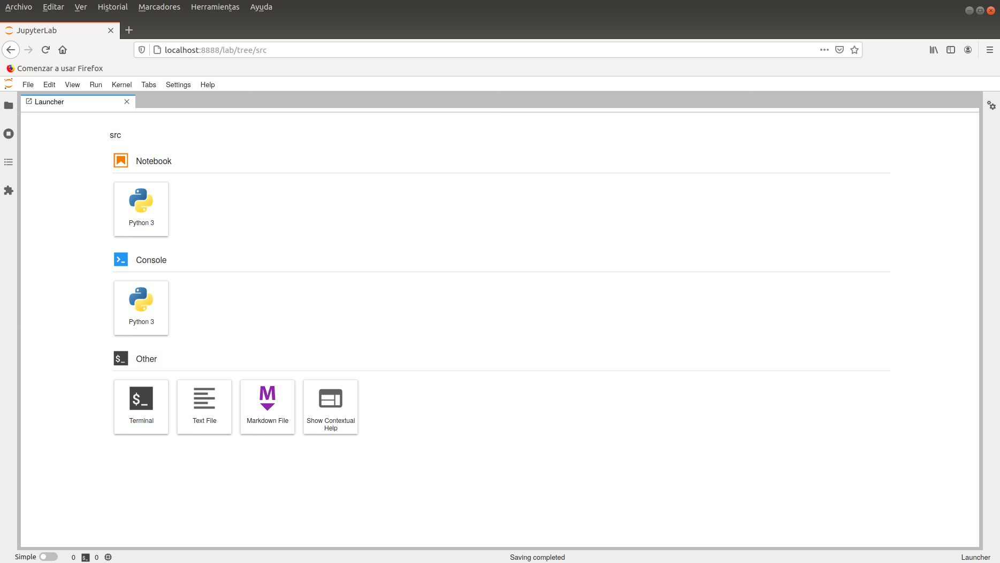

# Tecnologías Específicas en Ingeniería Informática • Configuración de Python

- [Tecnologías Específicas en Ingeniería Informática • Configuración de Python](#tecnologías-específicas-en-ingeniería-informática--configuración-de-python)
  - [Instalación de Python con `pyenv`](#instalación-de-python-con-pyenv)
    - [¿Por qué no usamos la instalación de Python del sistema?](#por-qué-no-usamos-la-instalación-de-python-del-sistema)
    - [¿Por qué `pyenv`?](#por-qué-pyenv)
    - [Instalación y configuración de `pyenv`](#instalación-y-configuración-de-pyenv)
    - [Instalación de Python](#instalación-de-python)
    - [¿Cómo decide `pyenv` qué instalación de Python usar?](#cómo-decide-pyenv-qué-instalación-de-python-usar)
  - [Entornos virtuales Python](#entornos-virtuales-python)
    - [¿Qué es y para qué sirve un entorno virtual Python?](#qué-es-y-para-qué-sirve-un-entorno-virtual-python)
    - [Creación y activación/desactivación de un entorno virtual con `virtualenv`](#creación-y-activacióndesactivación-de-un-entorno-virtual-con-virtualenv)
    - [Creación y activación/desactivación de un entorno virtual con `pyenv`](#creación-y-activacióndesactivación-de-un-entorno-virtual-con-pyenv)
    - [Instalación de paquetes Python en un entorno virtual con `pip3`](#instalación-de-paquetes-python-en-un-entorno-virtual-con-pip3)
    - [Verificación de una instalación de Python](#verificación-de-una-instalación-de-python)
  - [Proyecto Jupyter](#proyecto-jupyter)
    - [Jupyter Lab](#jupyter-lab)
  - [Google Colaboratory](#google-colaboratory)
  - [Ejercicios](#ejercicios)
    - [Creación de entornos virtuales con `venv`](#creación-de-entornos-virtuales-con-venv)
    - [Creación de entornos virtuales con `pyenv`](#creación-de-entornos-virtuales-con-pyenv)
  - [Referencias](#referencias)
    - [`pyenv`](#pyenv)
    - [Entornos virtuales (*virtual environments*)](#entornos-virtuales-virtual-environments)
    - [Jupyter](#jupyter)

___

## Instalación de Python con `pyenv`

### ¿Por qué no usamos la instalación de Python del sistema?

La instalación de Python del sistema es la instalación por defecto del sistema
operativo:

```bash
$ python3 -V
3.X.X

$ which python3
/usr/bin/python3
```

Se pueden instalar nuevos paquetes o actualizar los existentes con la
herramienta `pip3`:

```bash
$ pip3 -V
pip X.X.X from /path/to/pip (python 3.X)

$ which pip3
/usr/bin/pip3
```

:warning: La herramienta `pip3` no forma parte de la instalación de Python del
sistema en Ubuntu. Para instalarla, teclea `sudo apt-get update && sudo apt-get
install python3-pip`.

Por ejemplo, se puede instalar el paquete `pandas`, que a su vez instala la
dependencia `numpy`, con la siguiente orden:

```bash
$ pip3 install pandas
...
Successfully installed numpy-X.X.X pandas-X.X.X
```

En Ubuntu, los paquetes Python presentes en la instalación por defecto del
sistema operativo se encuentran en `/usr/lib/python3/dist-packages/`, mientras
que los paquetes Python instalados por el usuario se guardan en
`$HOME/.local/lib/python3.10/site-packages/`.

Utilizar la instalación de Python del sistema para el desarrollo de aplicaciones
plantea algunos problemas:

- Cambiar la versión de la instalación de Python del sistema o la de sus
  paquetes podría hacer que algunas herramientas esenciales para el
  mantenimiento del sistema dejasen de funcionar correctamente.
- Instalar otras versiones de Python con un gestor de paquetes, como `apt-get`
  en Ubuntu o `yum` en Fedora:
  - No siempre es posible, por ejemplo, `miniconda` no se puede instalar con un
    gestor de paquetes.
  - No resulta aconsejable, por ejemplo, ¿qué versión usaría cada una aplicación
    o cómo podría un usuario cambiarla?

### ¿Por qué `pyenv`?

La herramienta `pyenv` resuelve los problemas anteriores porque permite:

- Instalar Python en la cuenta de un usuario sin privilegios de administrador.
- Instalar y gestionar múltiples instalaciones de Python de manera simultánea.
- Especificar qué versión de Python y paquetes instalados usar en cada proyecto.

### Instalación y configuración de `pyenv`

Instalación de dependencias de `pyenv` en Linux:

```bash
$ sudo apt-get -y install git make vim build-essential libssl-dev zlib1g-dev \
libbz2-dev libreadline-dev libsqlite3-dev wget curl llvm libncurses5-dev \
libncursesw5-dev xz-utils tk-dev libffi-dev liblzma-dev python3-openssl
```

Instalación de dependencias de `pyenv` en MacOS con `brew`:

<!-- markdownlint-disable MD014 -->
```bash
$ brew install openssl readline sqlite3 xz zlib
```
<!-- markdownlint-enable MD014 -->

Instalación de `pyenv`:

<!-- markdownlint-disable MD014 -->
```bash
$ curl https://pyenv.run | bash
```
<!-- markdownlint-enable MD014 -->

Configuración de `pyenv`:

```bash
echo 'export PYENV_ROOT="$HOME/.pyenv"'    >> $HOME/.bashrc
echo 'export PATH="$PYENV_ROOT/bin:$PATH"' >> $HOME/.bashrc
echo 'eval "$(pyenv init --path)"'         >> $HOME/.bashrc
echo 'eval "$(pyenv init -)"'              >> $HOME/.bashrc
echo 'eval "$(pyenv virtualenv-init -)"'   >> $HOME/.bashrc
exec $SHELL
```

:pushpin: `pyenv` se instala en `PYENV_ROOT`, es decir, en `$HOME/.pyenv`.

Si la instalación de `pyenv` ha finalizado con normalidad:

```bash
$ pyenv --version
pyenv 2.3.36-16-g21c2a3dd
```

### Instalación de Python

```bash
$ pyenv install --list | grep 3.10
$ pyenv install 3.10.13
...La instalación tardará varios minutos en completarse...
$ pyenv versions
$ python3 -V
```

La nueva instalación de Python se puede usar de manera global o sólo local, es
decir, para un directorio concreto:

<!-- markdownlint-disable MD014 -->
```bash
$ pyenv global 3.10.13
$ pyenv global
$ pyenv versions
$ pyenv version
$ python3 -V

$ pyenv global system
$ pyenv global
$ pyenv versions
$ pyenv version
$ python3 -V

$ mkdir 3.10.13 && cd "$_"
$ pyenv local 3.10.13
$ pyenv local
$ pyenv versions
$ pyenv version
$ python3 -V
$ cd .. && python3 -V
$ cd - && python3 -V
$ pyenv local --unset
$ cd .. && rm -fr 3.10.13
```
<!-- markdownlint-enable MD014 -->

### ¿Cómo decide `pyenv` qué instalación de Python usar?


## Entornos virtuales Python

### ¿Qué es y para qué sirve un entorno virtual Python?

Supongamos que trabajamos en dos proyectos, llamados `proyecto1` y `proyecto2`,
que requiren las versiones `1.4.3` y `1.5.3` del paquete Python `pandas`,
respectivamente. El problema reside en que sólo podemos instalar una de las dos
versiones con `pip3` en `site-packages`. Si intentamos instalar `pandas==1.4.3`
y, a continuación, `pandas==1.5.3`, veremos como para instalar la segunda
versión `pip3` desinstala la primera.

Los entornos virtuales Python son instalaciones de Python, basadas en una
instalación de Python base que normalmente es la del sistema, con un conjunto de
paquetes Python independiente. En el ejemplo anterior, crearíamos dos entornos
virtuales Python diferentes, por ejemplo `venv-proyecto1` y `venv-proyecto2`,
instalaríamos `pandas==1.4.3` en `venv-proyecto1` y `pandas==1.5.3` en
`venv-proyecto2`, y usaríamos cada uno de ellos para su proyecto.

### Creación y activación/desactivación de un entorno virtual con `virtualenv`

```bash
$ python3 -m venv venv-teii

$ source venv-teii/bin/activate

(venv-teii) $ which python3
/path/to/venv-teii/bin/python3

(venv-teii) $ ls -l $(which python3)
/path/to/venv-teii/bin/python3 -> /usr/bin/python3

(venv-teii) $ deactivate

$ rm -fr venv-teii
```

:warning: El paquete `venv` no forma parte de la instalación de Python del
sistema en Ubuntu. Para instalarlo, teclea `sudo apt-get update && sudo apt-get
install python3-venv`.

### Creación y activación/desactivación de un entorno virtual con `pyenv`

Creación de un entorno virtual:

<!-- markdownlint-disable MD014 -->
```bash
$ pyenv virtualenv 3.10.13 venv-teii
$ pyenv versions
```
<!-- markdownlint-enable MD014 -->

Activación/desactivación **explícita** de un entorno virtual:

```bash
$ pyenv activate venv-teii

(venv-teii) $ pyenv version
venv-teii (set by PYENV_VERSION environment variable)

(venv-teii) $ pyenv which python3
$HOME/.pyenv/versions/venv-teii/bin/python3

(venv-teii) $ ls -l $(pyenv which python3)
$HOME/.pyenv/versions/venv-teii/bin/python3 -> python3.8

(venv-teii) $ ls -l $(pyenv which python3.8)
$HOME/.pyenv/versions/venv-teii/bin/python3.8 -> $HOME/.pyenv/versions/3.10.13/bin/python3.8

(venv-teii) $ pyenv deactivate
```

Activación/desactivación **implícita** de un entorno virtual:

```bash
$ mkdir venv-teii-dir && cd "$_"

$ pyenv local venv-teii

(venv-teii) $ pyenv version
teii (set by /path/to/venv-teii-dir/.python-version)

(venv-teii) $ pyenv which python3
$HOME/.pyenv/versions/venv-teii/bin/python3

(venv-teii) $ pyenv local --unset

$ cd .. && rm -fr venv-teii-dir
```

### Instalación de paquetes Python en un entorno virtual con `pip3`

Tras la creación de un entorno virtual, resulta aconsejable actualizar la
herramienta `pip3` que se utiliza para instalar paquetes Python:

```bash
(venv-teii) $ python3 -m pip install --upgrade pip
```

La herramienta `pip3` permite instalar uno o más paquetes Python:

```bash
(venv-teii) $ pip3 install pandas
```

Si instalamos paquetes Python con la herramienta `pip3` del entorno virtual,
éstos se instalarán únicamente en él y, por tanto, no estarán accesibles ni en
la instalación de Python del sistema ni en otros entornos virtuales.


Para listar los paquetes instalados, obtener información sobre ellos o
eliminarlos:

```bash
(venv-teii) $ pip3 list
(venv-teii) $ pip3 show pandas
(venv-teii) $ pip3 uninstall pandas
```
Si instalamos el paquete 'pipdeptree' con la herramienta `pip3` del entorno virtual, podremos obtener un árbol de dependencias de los paquetes instalados:

```bash
(venv-teii) $ pip3 install pipdeptree
(venv-teii) $ pipdeptree
```

:pushpin: Esto nos permitirá saber qué paquetes y qué versiones de los mismos están instalados en el entorno virtual.

Con el comando 'pip3 freeze' obtendremos un listado de los paquetes instalados en el entorno virtual, que podremos guardar en un fichero de texto para su posterior uso:

```bash
(venv-teii) $ pip3 freeze > requirements.txt
```

:pushpin: Este fichero de texto se puede utilizar para instalar los mismos paquetes en otro entorno virtual, con el comando 'pip3 install -r requirements.txt'.

:pushpin: Con esto tambien podemos dejar un entorno virtual limpio y listo para su uso en otro momento. Usariamos el siguiente comando para desinstalar todos los paquetes instalados en el entorno virtual:

```bash
(venv-teii) $ pip3 freeze | xargs pip3 uninstall -y
```

### Verificación de una instalación de Python

```bash
(venv-teii) $ python3 -m test
...El proceso tardará un rato en completarse...
```

## Proyecto Jupyter

### Jupyter Lab

Jupyter Lab es un IDE que se ejecuta en el navegador que integra documentos de
texto, documentos en formato Markdown, consolas interactivas de Python, Jupyter
Notebooks y terminales.

Un Jupyter Notebook es un documento que combina código ejecutable, texto
(Markdown), ecuaciones, imágenes y gráficos.

Para instalar tanto Jupyter Lab como los *notebooks* Jupyter

```bash
(venv-jupyter) $ pip3 install jupyterlab==4.1.2 jupyterlab-lsp==5.0.1 jedi-language-server==0.41.3
Successfully installed...
```

El servidor del entorno Jupyter Lab se ejecuta con

```bash
(venv-jupyter) $ jupyter lab
...Se abrirá un navegador...
```



## Google Colaboratory

En el caso de que estemos trabajando con una máquina sobre la que no podamos
instalar nada, siempre podemos utilizar el servicio Colaboratory de Google.
Simplemente teniendo una cuenta de Google (por ejemplo Gmail), tenemos acceso a
la ejecución en la nube de *notebooks* Jupyter, en máquinas virtuales
(habitualmente contenedores `docker`) que nos ofrecen un entorno ya
correctamente configurado para poder trabajar directamente. Además, tenemos la
posibilidad de solicitar el uso de una GPU, lo que puede acelerar nuestros
cálculos si estamos usando Python para álgebra lineal, o machine learning.

Este servicio se encuentra en <https://colab.research.google.com> y nos permite
subir nuestros notebooks o crearlos directamente, quedando almacenados en una
carpeta especial en nuestro Google Drive. También proporciona la posibilidad de
subir directamente notebooks almacenados en GitHub.

## Ejercicios

### Creación de entornos virtuales con `venv`

- Crea un entorno virtual `venv-proyecto1` con `venv` a partir de la instalación
  de Python del sistema.
- Activa `venv-proyecto1`, instala `pandas==1.4.3` y comprueba que la
  instalación es correcta.
- Crea un entorno virtual `venv-proyecto2` con `venv` a partir de la instalación
  de Python del sistema.
- Activa `venv-proyecto2`, instala `pandas==1.5.3` y comprueba que la
  instalación es correcta.
- Destruye los dos entornos virtuales `venv-proyecto1` y `venv-proyecto2`.

### Creación de entornos virtuales con `pyenv`

- Crea un entorno virtual `venv-proyecto1` con `pyenv` a partir de Python
`3.9.18`.
- Crea otro entorno virtual `venv-proyecto2` con `pyenv` a partir de Python
`3.9.18`.
- Crea un directorio `proyecto1`, configura la activación/desactivación de
  `venv-proyecto1` en él de manera implícita, instala `pandas==1.4.3` en
  `venv-proyecto1` (sin activarlo explícitamente) y comprueba que la instalación
  es correcta.
- Activa `venv-proyecto2` de manera explícita, instala `pandas==1.5.3` y
  comprueba que la instalación es correcta.
- Elimina la activación/desactivación de `venv-proyecto1` en el directorio
  `proyecto1` y, a continuación, el directorio `proyecto1`.
- Destruye los dos entornos virtuales `venv-proyecto1` y `venv-proyecto2`.

:pushpin: Para comprobar la versión instalada de `pandas`, cuando un entorno
virtual está activo, basta con teclear `pip3 show pandas`.

## Referencias

### `pyenv`

- [Simple Python Version Management: `pyenv`](https://github.com/pyenv/pyenv)
  - [Command Reference](https://github.com/pyenv/pyenv/blob/master/COMMANDS.md)
- [Managing Multiple Python Versions with
  `pyenv`](https://realpython.com/intro-to-pyenv/)

### Entornos virtuales (*virtual environments*)

- [`venv` - Creation of virtual
  environments](https://docs.python.org/3/library/venv.html)
- [Python Virtual Environments: A
  Primer](https://realpython.com/python-virtual-environments-a-primer/)

### Jupyter

- [Project Jupyter](https://jupyter.org/)
- [Jupyter Lab Docs](https://jupyterlab.readthedocs.io/en/stable)
- [Jupyter Notebook Docs](https://jupyter-notebook.readthedocs.io/en/stable)
